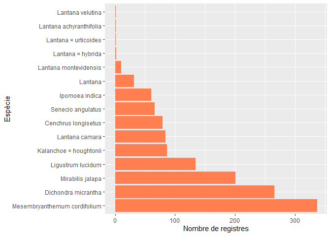

1.Descarrega
================
Erola Fenollosa
13/12/2021

## Introducció i descarrega de paquets

L’objectiu d’aquest codi és la descàrrega de les dades de iNaturalist i
el filtratge i neteja de les mateixes amb R. És el primer pas del cicle
d’anàlisi de les dades. L’adquisició i revisió d’aquestes. El projecte
de iNaturalist del qual volem descarregar la informació és:
<https://www.inaturalist.org/projects/especies-susceptibles-a-ser-invasores-a-barcelona-actuem-a-temps?tab=observations&subtab=table>.

Un dels paquets que podem requerir és ‘rinat’
<https://github.com/ropensci/rinat>, Un paquet desenvolupat per accedir
a les dades de ‘iNaturalist’ a través de APIs.

Carreguem els paquets necesaris:

``` r
#install.packages("rinat")
#install.packages("ecospat")
library(rinat)

library(ggplot2)
library(dplyr)

library(ecospat)
library(tidyverse)
```

Més info i exemples sobre el paquet rinat:

``` r
# vignette("rinat-intro", package = "rinat")
```

### 1\. Descàrrega de les dades del Projecte a iNaturalist

Per a descarregar les dades del projecte podem utilitzar la funció
get\_inat\_obs\_project() del paquet rinat. Amb el parametre type
indiquem que volem descarregar les observacions i amb Raw = false
descarreguem un datarfame.

``` r
act <- get_inat_obs_project("especies-susceptibles-a-ser-invasores-a-barcelona-actuem-a-temps", type = "observations", raw=FALSE)
```

### 2\. Revisió del dataset i comptatge de registres

Visualitzem els noms de les variables del dataset descarregat

``` r
names(act)
```

    ##  [1] "id"                                "observed_on"                      
    ##  [3] "description"                       "latitude"                         
    ##  [5] "longitude"                         "map_scale"                        
    ##  [7] "timeframe"                         "species_guess"                    
    ##  [9] "user_id"                           "taxon_id"                         
    ## [11] "created_at"                        "updated_at"                       
    ## [13] "place_guess"                       "id_please"                        
    ## [15] "observed_on_string"                "iconic_taxon_id"                  
    ## [17] "num_identification_agreements"     "num_identification_disagreements" 
    ## [19] "time_observed_at"                  "time_zone"                        
    ## [21] "location_is_exact"                 "delta"                            
    ## [23] "positional_accuracy"               "private_latitude"                 
    ## [25] "private_longitude"                 "geoprivacy"                       
    ## [27] "quality_grade"                     "positioning_method"               
    ## [29] "positioning_device"                "out_of_range"                     
    ## [31] "license"                           "uri"                              
    ## [33] "observation_photos_count"          "comments_count"                   
    ## [35] "zic_time_zone"                     "oauth_application_id"             
    ## [37] "observation_sounds_count"          "identifications_count"            
    ## [39] "captive"                           "community_taxon_id"               
    ## [41] "site_id"                           "old_uuid"                         
    ## [43] "public_positional_accuracy"        "mappable"                         
    ## [45] "cached_votes_total"                "last_indexed_at"                  
    ## [47] "private_place_guess"               "uuid"                             
    ## [49] "taxon_geoprivacy"                  "tag_list"                         
    ## [51] "short_description"                 "user_login"                       
    ## [53] "iconic_taxon_name"                 "faves_count"                      
    ## [55] "created_at_utc"                    "updated_at_utc"                   
    ## [57] "time_observed_at_utc"              "owners_identification_from_vision"
    ## [59] "photos"                            "taxon.id"                         
    ## [61] "taxon.name"                        "taxon.rank"                       
    ## [63] "taxon.ancestry"                    "taxon.common_name.id"             
    ## [65] "taxon.common_name.name"            "taxon.common_name.is_valid"       
    ## [67] "taxon.common_name.lexicon"         "iconic_taxon.id"                  
    ## [69] "iconic_taxon.name"                 "iconic_taxon.rank"                
    ## [71] "iconic_taxon.rank_level"           "iconic_taxon.ancestry"            
    ## [73] "user.login"                        "user.user_icon_url"

Comptabilitzem el nombre de registres considerant la data actual:

``` r
print(paste("El nombre de registres actual (En data:", Sys.Date(), ") del projecte és: ", dim(act)[1]))
```

    ## [1] "El nombre de registres actual (En data: 2021-12-16 ) del projecte és:  1441"

### 3\. Filtrem per precisió geogràfica

Revisem els rangs de les diferents variables numèriques. Fem un
histograma:

``` r
hist(act$positional_accuracy)
```

<!-- -->

És destacable el fet que hi ha algunes dades amb una precisió geogràfica
molt alta. Tenen poc sentit, Revisem el valor màxim:

``` r
max(act$positional_accuracy, na.rm = TRUE)
```

    ## [1] 2916

Penso que seria necesari filtrar i eliminar aquells registres que no
tenen una precisió inferior a 300m per exemple. Revisem quants registres
hi ha discretitzant la variable:

``` r
Categories <- cut(act$positional_accuracy, breaks = c(-Inf,10,50, 100, 300,Inf), labels = c("<10","10-50","50-100", "100-300", ">300"))
table(Categories)
```

    ## Categories
    ##     <10   10-50  50-100 100-300    >300 
    ##    1166     152      30      15      31

Sembla que hi ha 31 registres amb massa poca precisió (\> 300m).
Eliminem aquests registres:

``` r
actp <- act[act$positional_accuracy < 300,]
hist(actp$positional_accuracy)
```

<!-- -->

Revisem els registres actuals:

``` r
print(paste("El nombre de registres actual (En data:", Sys.Date(), ") del projecte és: ", dim(actp)[1]))
```

    ## [1] "El nombre de registres actual (En data: 2021-12-16 ) del projecte és:  1408"

Per especie:

``` r
ggplot(actp, aes(x=positional_accuracy, fill=taxon.name)) +
  geom_density(alpha=0.4)
```

<!-- -->

### 4\. Eliminació de registres buits

Sembla que tenim registres sene nom d’espècie, amb NA

``` r
unique(actp$taxon.name)
```

    ##  [1] "Cenchrus longisetus"          "Kalanchoe × houghtonii"      
    ##  [3] "Ligustrum lucidum"            "Dichondra micrantha"         
    ##  [5] "Senecio angulatus"            "Mirabilis jalapa"            
    ##  [7] "Mesembryanthemum cordifolium" NA                            
    ##  [9] "Lantana camara"               "Lantana"                     
    ## [11] "Ipomoea indica"               "Lantana montevidensis"       
    ## [13] "Lantana × urticoides"         "Lantana × hybrida"           
    ## [15] "Lantana achyranthifolia"      "Lantana velutina"

Contem-los:

``` r
sum(is.na(actp$taxon.name))
```

    ## [1] 47

Eliminem aquells registres que no tenen nom d’especie:

``` r
actpn <- actp[!is.na(actp$taxon.name),]
sum(is.na(actpn$taxon.name))
```

    ## [1] 0

### 5\. Gràfic d’acumulació de registres

Revisem el nombre de registres en el temps. Primer transformem la data

``` r
actpn$observed_on_DATE <- as.Date(actpn$observed_on)
```

``` r
ggplot(actpn, aes(observed_on_DATE))+stat_bin(aes(y=cumsum(..count..)),geom="line",bins=500)
```

<!-- -->

Ara incloem una línia que delimiti la data d’inici del projecte (11 de
novembre de 2021) i comptabilitzem els registres anteriors i posteriors:

``` r
ggplot(actpn, aes(observed_on_DATE))+stat_bin(aes(y=cumsum(..count..)),geom="line",bins=500) + geom_vline(xintercept=as.Date("2021-11-06"), linetype=4)
```

<!-- -->

Vegem-ho amb nombres absoluts:

``` r
a <- cut(actpn$observed_on_DATE, breaks = as.Date(c("2001-11-06", "2021-11-06", "2022-11-06")), labels = c("Abans d'iniciar el projecte","Després d'iniciar el projecte"))
table(a)
```

    ## a
    ##   Abans d'iniciar el projecte Després d'iniciar el projecte 
    ##                           246                          1114

### 6\. Eliminació d’espècies poc representades

Primer calculem quants registres totals hi ha de cada espècie:

``` r
actpn %>% count(taxon.name, sort = TRUE)
```

    ##                      taxon.name   n
    ## 1  Mesembryanthemum cordifolium 337
    ## 2           Dichondra micrantha 266
    ## 3              Mirabilis jalapa 201
    ## 4             Ligustrum lucidum 134
    ## 5        Kalanchoe × houghtonii  87
    ## 6                Lantana camara  84
    ## 7           Cenchrus longisetus  79
    ## 8             Senecio angulatus  66
    ## 9                Ipomoea indica  60
    ## 10                      Lantana  32
    ## 11        Lantana montevidensis  10
    ## 12            Lantana × hybrida   2
    ## 13         Lantana × urticoides   1
    ## 14      Lantana achyranthifolia   1
    ## 15             Lantana velutina   1

Veiem-ho gràficament:

``` r
ggplot(actpn,aes(x = fct_infreq(taxon.name))) + 
    geom_bar(stat = 'count', fill = "coral")+ coord_flip() + xlab("Espècie")+ ylab("Nombre de registres")
```

<!-- -->

Descartarem aquells taxons que estàn molt poc representats, eliminarem
els taxons amb menys de 30 registres.

``` r
recompte <- actpn %>% count(taxon.name, sort = TRUE)
recompte_30 <- recompte[recompte$n > 30,]
actpnr <- actpn[actpn$taxon.name %in% recompte_30$taxon.name,]
unique(actpnr$taxon.name) # Imprimim amb quins taxons continuem l'anàlisi i les dimensions
```

    ##  [1] "Cenchrus longisetus"          "Kalanchoe × houghtonii"      
    ##  [3] "Ligustrum lucidum"            "Dichondra micrantha"         
    ##  [5] "Senecio angulatus"            "Mirabilis jalapa"            
    ##  [7] "Mesembryanthemum cordifolium" "Lantana camara"              
    ##  [9] "Lantana"                      "Ipomoea indica"

``` r
dim(actpnr)
```

    ## [1] 1346   75

### 7\. Eliminació de duplicats

Al tractar-se d’una identificació col·lectiva, és possible que la
presència d’alguna espècie en un determinat indret hagi estat
identificada per duplicat. Ens interessa eliminar aquestes
identificacions duplicades per no esviaixar en nombre final de registres
però cal assegurar que no es tractava simplement d’individus molt
propers. Per a fer-ho, proposo filtrar registres d’una mateixa espècie
amb una elevada proximitat, definint elevada proximitat com a 50cm de
distància, és a dir 0.5m de distància. Aquest procés es coneix també com
eliminació d’agregats. Proposo l’ús de la funció
‘ecospat.occ.desaggregation’(<https://rdrr.io/cran/ecospat/man/ecospat.occ.desaggregation.html>),
del paquet ‘ecospat’ desenvolupat per Di Cola et al. (2016)
(<https://rdrr.io/cran/ecospat/>), que permet filtrar registres propers
en base a una distància a definir per l’usuari i permet identificar
grups dins del dataset. Abans però caldrà revisar si hi ha duplicats i
descartarem espècies amb menys de 10 registres.

``` r
xydf <- data.frame(x=actpnr$latitude, y=actpnr$longitude, by=actpnr$taxon.name) # creem un dataframe per a introduir a la funció. 
xydf_1<-xydf[!duplicated(xydf),] # Es necessari filtrar duplicats

prov <- ecospat.occ.desaggregation(xydf_1, min.dist = 0.008333/1000*0.5, by = 'by') # Introduim la distància que acceptarem en graus, tenint en compte que 0.008333 corresponen a 1km a l'equador. Considero com a distància minima a acceptar 0.5m.
```

    ## [1] "desaggregate species 1"
    ## [1] "desaggregate species 2"
    ## [1] "desaggregate species 3"
    ## [1] "desaggregate species 4"
    ## [1] "desaggregate species 5"
    ## [1] "desaggregate species 6"
    ## [1] "desaggregate species 7"
    ## [1] "desaggregate species 8"
    ## [1] "desaggregate species 9"
    ## [1] "desaggregate species 10"
    ## $initial
    ## [1] 1345
    ## 
    ## $kept
    ## [1] 1341
    ## 
    ## $out
    ## [1] 4

Ara recuperem les dades d’aquests registres que hem seleccionat
desagregant les dades:

``` r
prov$mat <- as.numeric(prov$x) * as.numeric(prov$y)
actpnr$mat1 <- as.numeric(actpnr$latitude) * as.numeric(actpnr$longitude)
actpnrf <- merge(prov,actpnr, by.x="mat", by.y="mat1")
actpnrf <- subset(actpnrf, select = -c(mat, x, y, by))
dim(actpnrf) # Revisem nombre de registres
```

    ## [1] 1342   75

### 8\. Exportem el dataset

Guardem el dataset:

``` r
# Eliminem les variables de tipus list dins del dataset per a poder guardar-lo:
actpnrfs = subset(actpnrf, select = -c(tag_list, photos))
write.csv(actpnrfs,"actpnrfs.csv")
```

### 9\. Revisió de nombre de registres finals

Revisem els registres finals:

``` r
print(paste("El nombre de registres actual (En data:", Sys.Date(), ") del projecte és: ", dim(actpnrfs)[1]))
```

    ## [1] "El nombre de registres actual (En data: 2021-12-16 ) del projecte és:  1342"
