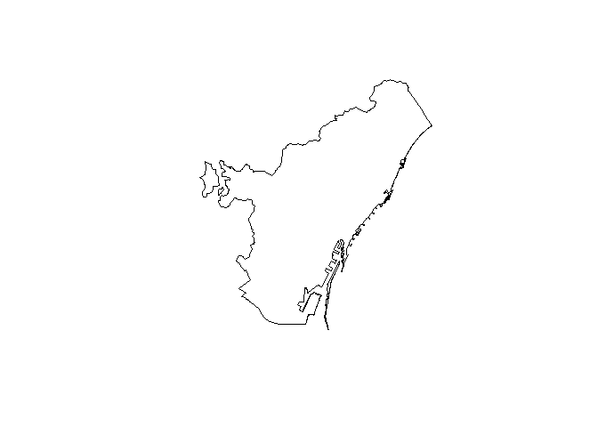
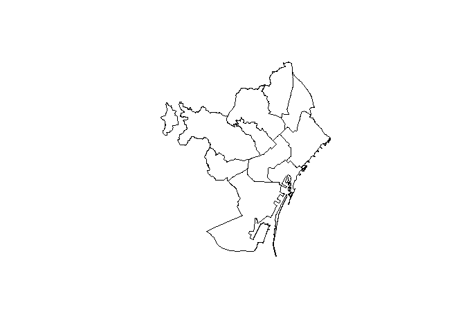
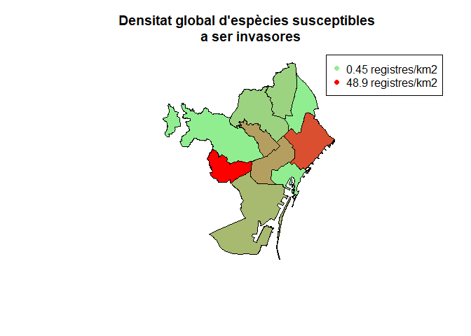

2CalculDensitats
================
Erola Fenollosa
14/12/2021

## Introducció i descarrega de paquets

L’objectiu d’aquest codi és generar el càlcul de les densitats de
presència de les espècies susceptibles a ser invasores a la ciutat de
Barcelona del projecte “Actuem a temps: espècies susceptibles de ser
invasores a la ciutat de Barcelona”. El codi permetrà calcular el nombre
de registres/m2 mitjà que hi ha a la ciutat de forma global i també per
a cada espècie, possibilitat també l’anàlisi de zones en concret
introduint polígons d’espais amb major esforç de mostreig o amb alguna
peculiaritat.

Carreguem els paquets necesaris:

``` r
library('sf')
```

    ## Linking to GEOS 3.9.0, GDAL 3.2.1, PROJ 7.2.1

``` r
library(dplyr)
```

    ## 
    ## Attaching package: 'dplyr'

    ## The following objects are masked from 'package:stats':
    ## 
    ##     filter, lag

    ## The following objects are masked from 'package:base':
    ## 
    ##     intersect, setdiff, setequal, union

``` r
library(leaflet)
library(raster)
```

    ## Warning: package 'raster' was built under R version 4.1.2

    ## Loading required package: sp

    ## 
    ## Attaching package: 'raster'

    ## The following object is masked from 'package:dplyr':
    ## 
    ##     select

``` r
library(tidyverse)
```

    ## Warning: package 'tidyverse' was built under R version 4.1.2

    ## -- Attaching packages --------------------------------------- tidyverse 1.3.1 --

    ## v ggplot2 3.3.5     v purrr   0.3.4
    ## v tibble  3.1.4     v stringr 1.4.0
    ## v tidyr   1.1.4     v forcats 0.5.1
    ## v readr   2.1.1

    ## Warning: package 'tidyr' was built under R version 4.1.2

    ## Warning: package 'readr' was built under R version 4.1.2

    ## Warning: package 'forcats' was built under R version 4.1.2

    ## -- Conflicts ------------------------------------------ tidyverse_conflicts() --
    ## x tidyr::extract() masks raster::extract()
    ## x dplyr::filter()  masks stats::filter()
    ## x dplyr::lag()     masks stats::lag()
    ## x raster::select() masks dplyr::select()

Carreguem el dataset generat per 1Descarrega.Rmd:

``` r
actpnrfs <- read.csv(file = 'actpnrfs.csv')
```

## Delimitació de l’àrea global del projecte

En primer lloc necesitem quantificar l’àrea del projecte. Es va definir
el projecte a iNaturalist
(<https://www.inaturalist.org/projects/especies-susceptibles-a-ser-invasores-a-barcelona-actuem-a-temps?tab=about>)
en l’àrea del Barcelonés (<https://www.inaturalist.org/places/140344>),
però cal descarregar una capa per a calcular l’àrea que suposa aquest
polígon. A wikipèdia s’indica que l’àrea ocupa 145,75 km², però volem
desenvolupar el codi per a poder mesurar-la.

Podem descarregar un csv amb els limits del Barcelonés a partir de
<https://vangdata.carto.com/tables/shapefiles_catalunya_comarcas/public/map>.
Descarreguem els arxius del Barcelonés i els posem a la carpeta.

``` r
barcelones_sp <- shapefile('shapefiles_catalunya_comarcas/shapefiles_catalunya_comarcas.shp')
plot(barcelones_sp)
```

<!-- -->

N’obtenim l’àrea en Km2:

``` r
area(barcelones_sp)/1000000
```

    ## [1] 146.383

### Densitat total registres

En primer lloc filtrarem els registres dins l’àrea (teòricament haurien
de entrar tots dins l’àrea). Per a fer-ho convertirem el dataframe de
iNaturalist amb les dades de registres a un objecte de tipus sf. Més
informació a
<https://ucanr-igis.github.io/tech_notes/inaturalist_map.html>

``` r
inat_obs_sf <-  actpnrfs %>% 
  st_as_sf(coords=c("longitude", "latitude"), crs=4326)

dim(inat_obs_sf)
```

    ## [1] 1342   73

Fem el filtratge de l’àrea, per a fer-ho necesitem transformar el shp de
l’àrea en un sf, el tornem a carregar amb la funció st\_read:

``` r
barcelones <- st_read('shapefiles_catalunya_comarcas/shapefiles_catalunya_comarcas.shp')
```

    ## Reading layer `shapefiles_catalunya_comarcas' from data source 
    ##   `C:\Users\erola\Documents\ANALISIACTUEM\Actuem_a_temps_BCN\shapefiles_catalunya_comarcas\shapefiles_catalunya_comarcas.shp' 
    ##   using driver `ESRI Shapefile'
    ## Simple feature collection with 1 feature and 5 fields
    ## Geometry type: MULTIPOLYGON
    ## Dimension:     XY
    ## Bounding box:  xmin: 2.052651 ymin: 41.31702 xmax: 2.269917 ymax: 41.49271
    ## Geodetic CRS:  WGS 84

``` r
inat_obs_pcsp_sf  <- inat_obs_sf %>% st_intersection(barcelones)
```

    ## Warning: attribute variables are assumed to be spatially constant throughout all
    ## geometries

``` r
nrow(inat_obs_pcsp_sf)
```

    ## [1] 1339

Calculem la densitat total de registres per km2:

``` r
print(paste("El nombre de registres actual al Barcelonès (En data:", Sys.Date(), ") és: ", round(nrow(inat_obs_pcsp_sf)/(area(barcelones_sp)/1000000),3), "registres/km2"))
```

    ## [1] "El nombre de registres actual al Barcelonès (En data: 2021-12-16 ) és:  9.147 registres/km2"

### Densitat total per espècie

Tal i com ja vèiem a l’anterior codi, el nombre de registres al
Barcelonés de cada espècie és el següent, podem veure-ho ordenat de més
a menys registres, observant quines són les espècies susceptibles a ser
invasores més presents a la demarcació:

``` r
ggplot(inat_obs_pcsp_sf,aes(x = fct_infreq(taxon.name))) + 
    geom_bar(stat = 'count', fill = "coral")+ coord_flip() + xlab("Espècie")+ ylab("Nombre de registres")
```

<!-- -->

Ara calculem la densitat de cadascuna de les espècies en el global de la
ciutat en nº de registres/km2:

``` r
dens <- as.data.frame(inat_obs_pcsp_sf %>% count(taxon.name, sort = TRUE))
dens <- subset(dens, select = -c(geometry))
dens$densitat.global <- round(dens$n/(area(barcelones_sp)/1000000),3)
dens
```

    ##                      taxon.name   n densitat.global
    ## 1  Mesembryanthemum cordifolium 336           2.295
    ## 2           Dichondra micrantha 266           1.817
    ## 3              Mirabilis jalapa 200           1.366
    ## 4             Ligustrum lucidum 134           0.915
    ## 5        Kalanchoe × houghtonii  86           0.587
    ## 6                Lantana camara  83           0.567
    ## 7           Cenchrus longisetus  78           0.533
    ## 8             Senecio angulatus  65           0.444
    ## 9                Ipomoea indica  59           0.403
    ## 10                      Lantana  32           0.219

### Densitat per districtes de Barcelona

Per a evaluar si hi ha diferències en les diferents zones de Barcelona,
per exemple entre diferents barris, ens caldrà definir els polígons pels
quals volem quantificar els registres.

Descarreguem l’arxiu shp de: <http://w20.bcn.cat/cartobcn/default.aspx>
amb els districtes de barcelona i grafiquem:

``` r
districtes <- shapefile('CartoBCN-2021-dic-16-163718/Unitats Administratives/SHP/BCN_UNITATS_ADM/0301040100_Districtes_UNITATS_ADM.shp')
```

    ## Warning in OGRSpatialRef(dsn, layer, morphFromESRI = morphFromESRI, dumpSRS =
    ## dumpSRS, : Discarded datum European_Terrestrial_Reference_System_1989 in Proj4
    ## definition: +proj=utm +zone=31 +ellps=GRS80 +towgs84=0,0,0,0,0,0,0 +units=m
    ## +no_defs

``` r
plot(districtes)
```

<!-- -->

Calculem l’àrea de cada districte:

``` r
arees<- data.frame(codi_districte = districtes$DISTRICTE, nom_districte = c("Ciutat Vella", "L'Eixample", "Sants-Montjuic", "Les Corts", "Sarrià - Sant Gervasi", "Gràcia", "Horta-Guinardó", "Nou Barris", "Sant Andreu", "Sant Martí") , area = area(districtes)/1000000)
arees
```

    ##    codi_districte         nom_districte      area
    ## 1              01          Ciutat Vella  4.204931
    ## 2              02            L'Eixample  7.464303
    ## 3              03        Sants-Montjuic 22.879850
    ## 4              04             Les Corts  6.010769
    ## 5              05 Sarrià - Sant Gervasi 19.915566
    ## 6              06                Gràcia  4.224278
    ## 7              07        Horta-Guinardó 11.919631
    ## 8              08            Nou Barris  8.056468
    ## 9              09           Sant Andreu  6.592480
    ## 10             10            Sant Martí 10.436698

Per a tenir shp de cada districte els descarreguem de:
<https://vangdata.carto.com/tables/shapefiles_barcelona_distrito/public>

``` r
ciutatvella<- st_read('Districtes/ciutatvella/shapefiles_barcelona_distrito.shp')
```

    ## Reading layer `shapefiles_barcelona_distrito' from data source 
    ##   `C:\Users\erola\Documents\ANALISIACTUEM\Actuem_a_temps_BCN\Districtes\ciutatvella\shapefiles_barcelona_distrito.shp' 
    ##   using driver `ESRI Shapefile'
    ## Simple feature collection with 1 feature and 12 fields
    ## Geometry type: POLYGON
    ## Dimension:     XY
    ## Bounding box:  xmin: 2.16311 ymin: 41.35763 xmax: 2.199723 ymax: 41.39222
    ## Geodetic CRS:  WGS 84

``` r
eixample <- st_read('Districtes/eixample/shapefiles_barcelona_distrito.shp')
```

    ## Reading layer `shapefiles_barcelona_distrito' from data source 
    ##   `C:\Users\erola\Documents\ANALISIACTUEM\Actuem_a_temps_BCN\Districtes\eixample\shapefiles_barcelona_distrito.shp' 
    ##   using driver `ESRI Shapefile'
    ## Simple feature collection with 1 feature and 12 fields
    ## Geometry type: POLYGON
    ## Dimension:     XY
    ## Bounding box:  xmin: 2.142324 ymin: 41.37498 xmax: 2.186825 ymax: 41.41204
    ## Geodetic CRS:  WGS 84

``` r
santsmontjuic <- st_read('Districtes/SantsMontjuic/shapefiles_barcelona_distrito.shp')
```

    ## Reading layer `shapefiles_barcelona_distrito' from data source 
    ##   `C:\Users\erola\Documents\ANALISIACTUEM\Actuem_a_temps_BCN\Districtes\SantsMontjuic\shapefiles_barcelona_distrito.shp' 
    ##   using driver `ESRI Shapefile'
    ## Simple feature collection with 1 feature and 12 fields
    ## Geometry type: POLYGON
    ## Dimension:     XY
    ## Bounding box:  xmin: 2.10147 ymin: 41.31692 xmax: 2.183542 ymax: 41.38547
    ## Geodetic CRS:  WGS 84

``` r
lescorts <- st_read('Districtes/lescorts/shapefiles_barcelona_distrito.shp')
```

    ## Reading layer `shapefiles_barcelona_distrito' from data source 
    ##   `C:\Users\erola\Documents\ANALISIACTUEM\Actuem_a_temps_BCN\Districtes\lescorts\shapefiles_barcelona_distrito.shp' 
    ##   using driver `ESRI Shapefile'
    ## Simple feature collection with 1 feature and 12 fields
    ## Geometry type: POLYGON
    ## Dimension:     XY
    ## Bounding box:  xmin: 2.097872 ymin: 41.37568 xmax: 2.144379 ymax: 41.40112
    ## Geodetic CRS:  WGS 84

``` r
sarriasantgervasi <- st_read('Districtes/sarriasantgervasi/shapefiles_barcelona_distrito.shp')
```

    ## Reading layer `shapefiles_barcelona_distrito' from data source 
    ##   `C:\Users\erola\Documents\ANALISIACTUEM\Actuem_a_temps_BCN\Districtes\sarriasantgervasi\shapefiles_barcelona_distrito.shp' 
    ##   using driver `ESRI Shapefile'
    ## Simple feature collection with 1 feature and 12 fields
    ## Geometry type: MULTIPOLYGON
    ## Dimension:     XY
    ## Bounding box:  xmin: 2.052451 ymin: 41.39008 xmax: 2.155661 ymax: 41.43716
    ## Geodetic CRS:  WGS 84

``` r
# gracia <- st_read('Districtes/gracia/shapefiles_barcelona_distrito.shp')
hortaguinardo <- st_read('Districtes/hortaguinardo/shapefiles_barcelona_distrito.shp')
```

    ## Reading layer `shapefiles_barcelona_distrito' from data source 
    ##   `C:\Users\erola\Documents\ANALISIACTUEM\Actuem_a_temps_BCN\Districtes\hortaguinardo\shapefiles_barcelona_distrito.shp' 
    ##   using driver `ESRI Shapefile'
    ## Simple feature collection with 1 feature and 12 fields
    ## Geometry type: POLYGON
    ## Dimension:     XY
    ## Bounding box:  xmin: 2.120446 ymin: 41.40696 xmax: 2.18084 ymax: 41.45046
    ## Geodetic CRS:  WGS 84

``` r
noubarris<- st_read('Districtes/Nou_Barris/shapefiles_barcelona_distrito.shp')
```

    ## Reading layer `shapefiles_barcelona_distrito' from data source 
    ##   `C:\Users\erola\Documents\ANALISIACTUEM\Actuem_a_temps_BCN\Districtes\Nou_Barris\shapefiles_barcelona_distrito.shp' 
    ##   using driver `ESRI Shapefile'
    ## Simple feature collection with 1 feature and 12 fields
    ## Geometry type: POLYGON
    ## Dimension:     XY
    ## Bounding box:  xmin: 2.155667 ymin: 41.42544 xmax: 2.188913 ymax: 41.46825
    ## Geodetic CRS:  WGS 84

``` r
santandreu<- st_read('Districtes/santandreu/shapefiles_barcelona_distrito.shp')
```

    ## Reading layer `shapefiles_barcelona_distrito' from data source 
    ##   `C:\Users\erola\Documents\ANALISIACTUEM\Actuem_a_temps_BCN\Districtes\santandreu\shapefiles_barcelona_distrito.shp' 
    ##   using driver `ESRI Shapefile'
    ## Simple feature collection with 1 feature and 12 fields
    ## Geometry type: POLYGON
    ## Dimension:     XY
    ## Bounding box:  xmin: 2.176161 ymin: 41.41367 xmax: 2.210601 ymax: 41.46213
    ## Geodetic CRS:  WGS 84

``` r
santmarti<- st_read('Districtes/santmarti/shapefiles_barcelona_distrito.shp')
```

    ## Reading layer `shapefiles_barcelona_distrito' from data source 
    ##   `C:\Users\erola\Documents\ANALISIACTUEM\Actuem_a_temps_BCN\Districtes\santmarti\shapefiles_barcelona_distrito.shp' 
    ##   using driver `ESRI Shapefile'
    ## Simple feature collection with 1 feature and 12 fields
    ## Geometry type: POLYGON
    ## Dimension:     XY
    ## Bounding box:  xmin: 2.175419 ymin: 41.38353 xmax: 2.229203 ymax: 41.43017
    ## Geodetic CRS:  WGS 84

Afegim la densitat total d’espècies, cal filtrar els registres en cada
districte. Faig una funció per a comptar registres per area

``` r
num_registres <- function(area, inatdf) {
  inat_obs_pcsp_sf  <- inatdf %>% st_intersection(area)
  print(nrow(inat_obs_pcsp_sf))
} 
```

``` r
arees$registres<- as.numeric(c(num_registres(ciutatvella, inat_obs_sf),
                    num_registres(eixample, inat_obs_sf),
                    num_registres(santsmontjuic, inat_obs_sf),
                    num_registres(lescorts, inat_obs_sf),
                    num_registres(sarriasantgervasi, inat_obs_sf),
                    NA,
                    num_registres(hortaguinardo, inat_obs_sf),
                    num_registres(noubarris, inat_obs_sf),
                    num_registres(santandreu, inat_obs_sf),
                    num_registres(santmarti, inat_obs_sf)))
```

    ## Warning: attribute variables are assumed to be spatially constant throughout all
    ## geometries

    ## [1] 6

    ## Warning: attribute variables are assumed to be spatially constant throughout all
    ## geometries

    ## [1] 127

    ## Warning: attribute variables are assumed to be spatially constant throughout all
    ## geometries

    ## [1] 267

    ## Warning: attribute variables are assumed to be spatially constant throughout all
    ## geometries

    ## [1] 294

    ## Warning: attribute variables are assumed to be spatially constant throughout all
    ## geometries

    ## [1] 54

    ## Warning: attribute variables are assumed to be spatially constant throughout all
    ## geometries

    ## [1] 102

    ## Warning: attribute variables are assumed to be spatially constant throughout all
    ## geometries

    ## [1] 69

    ## Warning: attribute variables are assumed to be spatially constant throughout all
    ## geometries

    ## [1] 3

    ## Warning: attribute variables are assumed to be spatially constant throughout all
    ## geometries

    ## [1] 346

``` r
arees$registres[6] <- nrow(inat_obs_sf) - sum(arees$registres, na.rm = TRUE)
arees$densitat.global <- arees$registres/arees$area
arees
```

    ##    codi_districte         nom_districte      area registres densitat.global
    ## 1              01          Ciutat Vella  4.204931         6        1.426896
    ## 2              02            L'Eixample  7.464303       127       17.014314
    ## 3              03        Sants-Montjuic 22.879850       267       11.669657
    ## 4              04             Les Corts  6.010769       294       48.912210
    ## 5              05 Sarrià - Sant Gervasi 19.915566        54        2.711447
    ## 6              06                Gràcia  4.224278        74       17.517787
    ## 7              07        Horta-Guinardó 11.919631       102        8.557312
    ## 8              08            Nou Barris  8.056468        69        8.564547
    ## 9              09           Sant Andreu  6.592480         3        0.455064
    ## 10             10            Sant Martí 10.436698       346       33.152247

Ordenem per densitat global:

``` r
arees[order(arees$densitat.global),]
```

    ##    codi_districte         nom_districte      area registres densitat.global
    ## 9              09           Sant Andreu  6.592480         3        0.455064
    ## 1              01          Ciutat Vella  4.204931         6        1.426896
    ## 5              05 Sarrià - Sant Gervasi 19.915566        54        2.711447
    ## 7              07        Horta-Guinardó 11.919631       102        8.557312
    ## 8              08            Nou Barris  8.056468        69        8.564547
    ## 3              03        Sants-Montjuic 22.879850       267       11.669657
    ## 2              02            L'Eixample  7.464303       127       17.014314
    ## 6              06                Gràcia  4.224278        74       17.517787
    ## 10             10            Sant Martí 10.436698       346       33.152247
    ## 4              04             Les Corts  6.010769       294       48.912210

### Mapa amb colors segons densitat

``` r
#library(RColorBrewer)

rbPal <- colorRampPalette(c('lightgreen','red'))
datcol <- rbPal(10)[as.numeric(cut(arees$densitat.global,breaks = 10))]

plot(districtes, col=datcol, main = "Densitat global d'espècies susceptibles \n a ser invasores")
legend('topright', legend=c("0.45 registres/km2", "48.9 registres/km2"), col=c("lightgreen","red"), pch=16)
```

<!-- -->

### Mapa registres iNaturalist

Preparem un pop-up per al mapa amb els registres per a poder veure
informació de cadascun. Podrem afegir també la imatge introduint la
localització dins del dataset del url. Es troba dins de photos –\>
small\_url, on photos és una variable de tipus list dins del dataframe:

``` r
#inat_obs_sf <-  actpnrf %>% # cal introduir el dataset amb les fotos (generat al final de l'script 1)
#  st_as_sf(coords=c("longitude", "latitude"), crs=4326)

#barcelones <- st_read('shapefiles_catalunya_comarcas/shapefiles_catalunya_comarcas.shp')
#inat_obs_pcsp_sf  <- inat_obs_sf %>% st_intersection(barcelones)

#inat_obs_pcsp_popup_sf <- inat_obs_pcsp_sf %>% 
#  mutate(popup_html = paste0("<p><b><i>", taxon.name, "</b><br/></i>",
#                             "User: ", user_login, "</p>",
#                             "<p></p>"))
```

Creem el mapa online amb leaflet. Només es visualitza correctament en R:

``` r
#leaflet(barcelones) %>% 
#  addProviderTiles("Esri.WorldStreetMap") %>% 
#  addPolygons() %>% 
#  addCircleMarkers(data = inat_obs_pcsp_popup_sf,
#                   popup = ~popup_html, 
#                   radius = 1)
```
