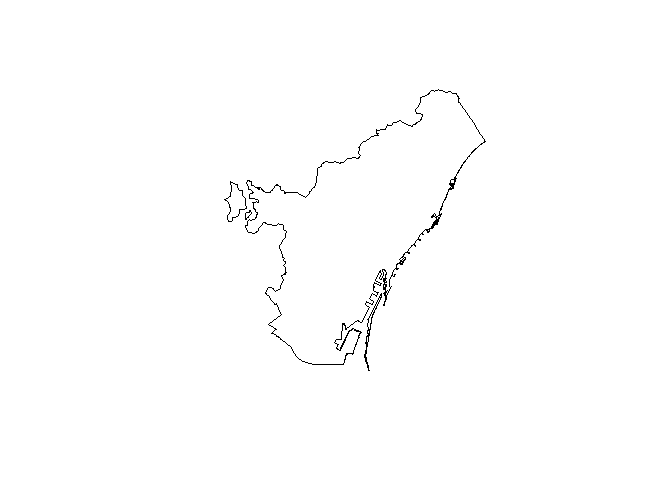
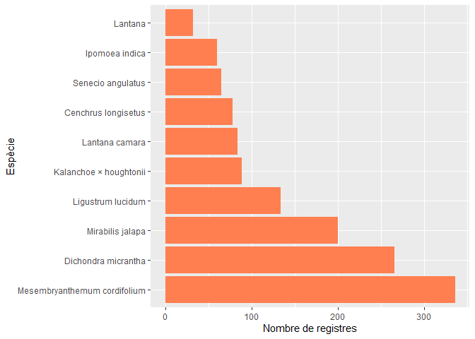
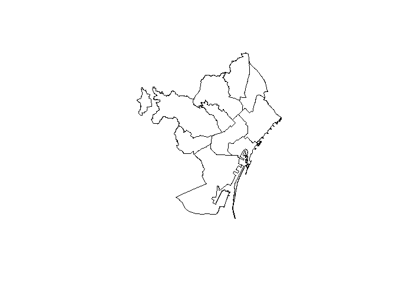
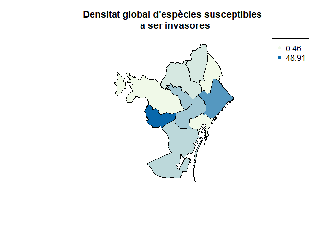
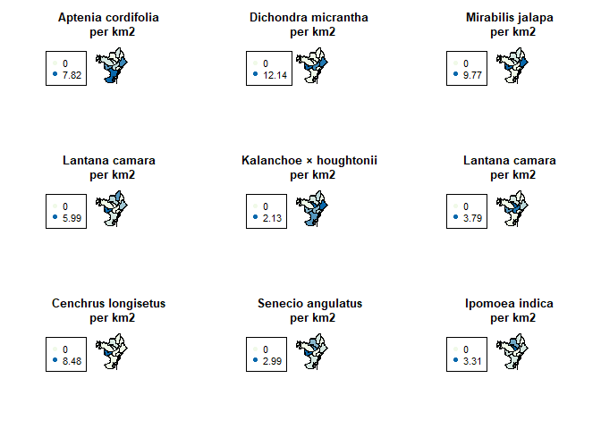

2CalculDensitats
================
Erola Fenollosa
14/12/2021

## Introducció i descarrega de paquets

L'objectiu d'aquest codi és generar el càlcul de les densitats de presència de les espècies susceptibles a ser invasores a la ciutat de Barcelona del projecte "Actuem a temps: espècies susceptibles de ser invasores a la ciutat de Barcelona". El codi permetrà calcular el nombre de registres/m2 mitjà que hi ha a la ciutat de forma global i també per a cada espècie, possibilitat també l'anàlisi de zones en concret introduint polígons d'espais amb major esforç de mostreig o amb alguna peculiaritat.

Carreguem els paquets necesaris:

``` r
library('sf')
library(dplyr)
#library(leaflet)
library(raster)
library(tidyverse)
#update.packages("Rcpp")
```

Carreguem el dataset generat per 1Descarrega.Rmd:

``` r
actpnrfs <- read.csv(file = 'Datasets/actpnrfs.csv')
```

## Delimitació de l'àrea global del projecte

En primer lloc necesitem quantificar l'àrea del projecte. Es va definir el projecte a iNaturalist (<https://www.inaturalist.org/projects/especies-susceptibles-a-ser-invasores-a-barcelona-actuem-a-temps?tab=about>) en l'àrea del Barcelonés (<https://www.inaturalist.org/places/140344>), però cal descarregar una capa per a calcular l'àrea que suposa aquest polígon. A wikipèdia s'indica que l'àrea ocupa 145,75 km², però volem desenvolupar el codi per a poder mesurar-la.

Podem descarregar un csv amb els limits del Barcelonés a partir de <https://vangdata.carto.com/tables/shapefiles_catalunya_comarcas/public/map>. Descarreguem els arxius del Barcelonés i els posem a la carpeta.

``` r
barcelones_sp <- shapefile('Cartografia/shapefiles_catalunya_comarcas/shapefiles_catalunya_comarcas.shp')
plot(barcelones_sp)
```



N'obtenim l'àrea en Km2:

``` r
area(barcelones_sp)/1000000
```

    ## [1] 146.383

### Densitat total registres

En primer lloc filtrarem els registres dins l'àrea (teòricament haurien de entrar tots dins l'àrea). Per a fer-ho convertirem el dataframe de iNaturalist amb les dades de registres a un objecte de tipus sf. Més informació a <https://ucanr-igis.github.io/tech_notes/inaturalist_map.html>

``` r
inat_obs_sf <-  actpnrfs %>% 
  st_as_sf(coords=c("longitude", "latitude"), crs=4326)

dim(inat_obs_sf)
```

    ## [1] 1347   73

Fem el filtratge de l'àrea, per a fer-ho necesitem transformar el shp de l'àrea en un sf, el tornem a carregar amb la funció st\_read:

``` r
barcelones <- st_read('Cartografia/shapefiles_catalunya_comarcas/shapefiles_catalunya_comarcas.shp')
inat_obs_pcsp_sf  <- inat_obs_sf %>% st_intersection(barcelones)
nrow(inat_obs_pcsp_sf)
```

Calculem la densitat total de registres per km2:

``` r
print(paste("El nombre de registres actual al Barcelonès (En data:", Sys.Date(), ") és: ", round(nrow(inat_obs_pcsp_sf)/(area(barcelones_sp)/1000000),3), "registres/km2"))
```

    ## [1] "El nombre de registres actual al Barcelonès (En data: 2021-12-29 ) és:  9.181 registres/km2"

### Densitat total per espècie

Tal i com ja vèiem a l'anterior codi, el nombre de registres al Barcelonés de cada espècie és el següent, podem veure-ho ordenat de més a menys registres, observant quines són les espècies susceptibles a ser invasores més presents a la demarcació:

``` r
ggplot(inat_obs_pcsp_sf,aes(x = fct_infreq(taxon.name))) + 
    geom_bar(stat = 'count', fill = "coral")+ coord_flip() + xlab("Espècie")+ ylab("Nombre de registres")
```



Ara calculem la densitat de cadascuna de les espècies en el global de la ciutat en nº de registres/km2:

``` r
dens <- as.data.frame(inat_obs_pcsp_sf %>% count(taxon.name, sort = TRUE))
dens <- subset(dens, select = -c(geometry))
dens$densitat.global <- round(dens$n/(area(barcelones_sp)/1000000),3)
dens
```

    ##                      taxon.name   n densitat.global
    ## 1  Mesembryanthemum cordifolium 336           2.295
    ## 2           Dichondra micrantha 266           1.817
    ## 3              Mirabilis jalapa 200           1.366
    ## 4             Ligustrum lucidum 134           0.915
    ## 5        Kalanchoe × houghtonii  89           0.608
    ## 6                Lantana camara  84           0.574
    ## 7           Cenchrus longisetus  78           0.533
    ## 8             Senecio angulatus  65           0.444
    ## 9                Ipomoea indica  60           0.410
    ## 10                      Lantana  32           0.219

### Densitat per districtes de Barcelona

Per a evaluar si hi ha diferències en les diferents zones de Barcelona, per exemple entre diferents barris, ens caldrà definir els polígons pels quals volem quantificar els registres.

Descarreguem l'arxiu shp de: <http://w20.bcn.cat/cartobcn/default.aspx> amb els districtes de barcelona i grafiquem:

``` r
districtes <- shapefile('Cartografia/CartoBCN-2021-dic-16-163718/Unitats Administratives/SHP/BCN_UNITATS_ADM/0301040100_Districtes_UNITATS_ADM.shp')
plot(districtes)
```



Calculem l'àrea de cada districte:

``` r
arees<- data.frame(codi_districte = districtes$DISTRICTE, nom_districte = c("Ciutat Vella", "L'Eixample", "Sants-Montjuic", "Les Corts", "Sarrià - Sant Gervasi", "Gràcia", "Horta-Guinardó", "Nou Barris", "Sant Andreu", "Sant Martí") , area = area(districtes)/1000000)
arees
```

    ##    codi_districte         nom_districte      area
    ## 1              01          Ciutat Vella  4.204931
    ## 2              02            L'Eixample  7.464303
    ## 3              03        Sants-Montjuic 22.879850
    ## 4              04             Les Corts  6.010769
    ## 5              05 Sarrià - Sant Gervasi 19.915566
    ## 6              06                Gràcia  4.224278
    ## 7              07        Horta-Guinardó 11.919631
    ## 8              08            Nou Barris  8.056468
    ## 9              09           Sant Andreu  6.592480
    ## 10             10            Sant Martí 10.436698

Per a tenir shp de cada districte els descarreguem de: <https://vangdata.carto.com/tables/shapefiles_barcelona_distrito/public>

``` r
ciutatvella<- st_read('Cartografia/Districtes/ciutatvella/shapefiles_barcelona_distrito.shp')
eixample <- st_read('Cartografia/Districtes/eixample/shapefiles_barcelona_distrito.shp')
santsmontjuic <- st_read('Cartografia/Districtes/SantsMontjuic/shapefiles_barcelona_distrito.shp')
lescorts <- st_read('Cartografia/Districtes/lescorts/shapefiles_barcelona_distrito.shp')
sarriasantgervasi <- st_read('Cartografia/Districtes/sarriasantgervasi/shapefiles_barcelona_distrito.shp')
# gracia <- st_read('Cartografia/Districtes/gracia/shapefiles_barcelona_distrito.shp')
hortaguinardo <- st_read('Cartografia/Districtes/hortaguinardo/shapefiles_barcelona_distrito.shp')
noubarris<- st_read('Cartografia/Districtes/Nou_Barris/shapefiles_barcelona_distrito.shp')
santandreu<- st_read('Cartografia/Districtes/santandreu/shapefiles_barcelona_distrito.shp')
santmarti<- st_read('Cartografia/Districtes/santmarti/shapefiles_barcelona_distrito.shp')
```

Afegim la densitat total d'espècies, cal filtrar els registres en cada districte. Faig una funció per a comptar registres per area

``` r
num_registres <- function(area, inatdf) {
  inat_obs_pcsp_sf  <- inatdf %>% st_intersection(area)
  return(nrow(inat_obs_pcsp_sf))
} 
```

``` r
arees$registres<- as.numeric(c(num_registres(ciutatvella, inat_obs_sf),
                    num_registres(eixample, inat_obs_sf),
                    num_registres(santsmontjuic, inat_obs_sf),
                    num_registres(lescorts, inat_obs_sf),
                    num_registres(sarriasantgervasi, inat_obs_sf),
                    NA,
                    num_registres(hortaguinardo, inat_obs_sf),
                    num_registres(noubarris, inat_obs_sf),
                    num_registres(santandreu, inat_obs_sf),
                    num_registres(santmarti, inat_obs_sf)))

arees$registres[6] <- nrow(inat_obs_sf) - sum(arees$registres, na.rm = TRUE)
arees$densitat.global <- arees$registres/arees$area
```

Mirem el dataset resultant:

``` r
arees
```

    ##    codi_districte         nom_districte      area registres densitat.global
    ## 1              01          Ciutat Vella  4.204931         6        1.426896
    ## 2              02            L'Eixample  7.464303       127       17.014314
    ## 3              03        Sants-Montjuic 22.879850       268       11.713363
    ## 4              04             Les Corts  6.010769       294       48.912210
    ## 5              05 Sarrià - Sant Gervasi 19.915566        54        2.711447
    ## 6              06                Gràcia  4.224278        78       18.464695
    ## 7              07        Horta-Guinardó 11.919631       102        8.557312
    ## 8              08            Nou Barris  8.056468        69        8.564547
    ## 9              09           Sant Andreu  6.592480         3        0.455064
    ## 10             10            Sant Martí 10.436698       346       33.152247

Ordenem per densitat global:

``` r
arees[order(arees$densitat.global),]
```

    ##    codi_districte         nom_districte      area registres densitat.global
    ## 9              09           Sant Andreu  6.592480         3        0.455064
    ## 1              01          Ciutat Vella  4.204931         6        1.426896
    ## 5              05 Sarrià - Sant Gervasi 19.915566        54        2.711447
    ## 7              07        Horta-Guinardó 11.919631       102        8.557312
    ## 8              08            Nou Barris  8.056468        69        8.564547
    ## 3              03        Sants-Montjuic 22.879850       268       11.713363
    ## 2              02            L'Eixample  7.464303       127       17.014314
    ## 6              06                Gràcia  4.224278        78       18.464695
    ## 10             10            Sant Martí 10.436698       346       33.152247
    ## 4              04             Les Corts  6.010769       294       48.912210

### Mapa amb colors segons densitat

``` r
#library(RColorBrewer)
rbPal <- colorRampPalette(c('#f0f9e8','#0868ac'))
colorsllegenda<- c("#f0f9e8","#0868ac")

datcol <- rbPal(10)[as.numeric(cut(arees$densitat.global,breaks = 10))]

plot(districtes, col=datcol, main = "Densitat global d'espècies susceptibles \n a ser invasores")
legend('topright', legend=c(round(min(arees$densitat.global),2), round(max(arees$densitat.global),2)), col=colorsllegenda, pch=16)
```



### Mapa amb color segons densitat per espècie

Cal calcular la densitat a cada districte i creear columnes dins del dataframe 'arees'. Preparo una funció per a poder contar qualsevol espècie per als districtes de Barcelona:

``` r
num_registres_especie <- function(especie) {
  registres_sp <- as.numeric(c(num_registres(ciutatvella, inat_obs_sf[inat_obs_sf$taxon.name==especie,]),
                    num_registres(eixample, inat_obs_sf[inat_obs_sf$taxon.name==especie,]),
                    num_registres(santsmontjuic, inat_obs_sf[inat_obs_sf$taxon.name==especie,]),
                    num_registres(lescorts, inat_obs_sf[inat_obs_sf$taxon.name==especie,]),
                    num_registres(sarriasantgervasi, inat_obs_sf[inat_obs_sf$taxon.name==especie,]),
                    NA,
                    num_registres(hortaguinardo, inat_obs_sf[inat_obs_sf$taxon.name==especie,]),
                    num_registres(noubarris, inat_obs_sf[inat_obs_sf$taxon.name==especie,]),
                    num_registres(santandreu, inat_obs_sf[inat_obs_sf$taxon.name==especie,]),
                    num_registres(santmarti, inat_obs_sf[inat_obs_sf$taxon.name==especie,])))

  registres_sp[6] <- nrow(inat_obs_sf[inat_obs_sf$taxon.name==especie,]) - sum(registres_sp, na.rm = TRUE)
  
  return(registres_sp)
} 
```

Per exemple, provem amb Lantana camara:

``` r
num_registres_especie("Lantana camara")
```

Ara calculem l'àrea:

``` r
round(num_registres_especie("Lantana camara")/arees$area, 2)
```

Calculem les densitats per a totes les espècies seleccionades

``` r
d_aptenia <- num_registres_especie("Mesembryanthemum cordifolium")/arees$area
d_dichondra <- num_registres_especie("Dichondra micrantha")/arees$area
d_mirabilis <- num_registres_especie("Mirabilis jalapa")/arees$area
d_ligustrum <- num_registres_especie("Ligustrum lucidum")/arees$area
d_kalanchoe <- num_registres_especie("Kalanchoe × houghtonii")/arees$area
d_lantana <- num_registres_especie("Lantana camara")/arees$area
d_cenchrus <- num_registres_especie("Cenchrus longisetus")/arees$area
d_senecio <- num_registres_especie("Senecio angulatus")/arees$area
d_ipomoea <- num_registres_especie("Ipomoea indica")/arees$area
```

Així podem entrar aquest valor directament al gràfic

``` r
rbPal <- colorRampPalette(c('#f0f9e8','#0868ac'))
colorsllegenda<- c("#f0f9e8","#0868ac")

par(mfrow=c(3,3))

datcol <- rbPal(10)[as.numeric(cut(d_aptenia,breaks = 10))]
plot(districtes, col=datcol, main = "Aptenia cordifolia \n per km2")
legend('bottomleft', legend=c(round(min(d_aptenia),2), round(max(d_aptenia),2)), col=colorsllegenda, pch=16)

datcol <- rbPal(10)[as.numeric(cut(d_dichondra,breaks = 10))]
plot(districtes, col=datcol, main = "Dichondra micrantha \n per km2")
legend('bottomleft', legend=c(round(min(d_dichondra),2), round(max(d_dichondra),2)), col=colorsllegenda, pch=16)

datcol <- rbPal(10)[as.numeric(cut(d_mirabilis,breaks = 10))]
plot(districtes, col=datcol, main = "Mirabilis jalapa \n per km2")
legend('bottomleft', legend=c(round(min(d_mirabilis),2), round(max(d_mirabilis),2)), col=colorsllegenda, pch=16)

datcol <- rbPal(10)[as.numeric(cut(d_ligustrum,breaks = 10))]
plot(districtes, col=datcol, main = "Lantana camara \n per km2")
legend('bottomleft', legend=c(round(min(d_ligustrum),2), round(max(d_ligustrum),2)), col=colorsllegenda, pch=16)

datcol <- rbPal(10)[as.numeric(cut(d_kalanchoe,breaks = 10))]
plot(districtes, col=datcol, main = "Kalanchoe × houghtonii \n per km2")
legend('bottomleft', legend=c(round(min(d_kalanchoe),2), round(max(d_kalanchoe),2)), col=colorsllegenda, pch=16)

datcol <- rbPal(10)[as.numeric(cut(d_lantana,breaks = 10))]
plot(districtes, col=datcol, main = "Lantana camara \n per km2")
legend('bottomleft', legend=c(round(min(d_lantana),2), round(max(d_lantana),2)), col=colorsllegenda, pch=16)

datcol <- rbPal(10)[as.numeric(cut(d_cenchrus,breaks = 10))]
plot(districtes, col=datcol, main = "Cenchrus longisetus \n per km2")
legend('bottomleft', legend=c(round(min(d_cenchrus),2), round(max(d_cenchrus),2)), col=colorsllegenda, pch=16)

datcol <- rbPal(10)[as.numeric(cut(d_senecio,breaks = 10))]
plot(districtes, col=datcol, main = "Senecio angulatus \n per km2")
legend('bottomleft', legend=c(round(min(d_senecio),2), round(max(d_senecio),2)), col=colorsllegenda, pch=16)

datcol <- rbPal(10)[as.numeric(cut(d_ipomoea,breaks = 10))]
plot(districtes, col=datcol, main = "Ipomoea indica \n per km2")
legend('bottomleft', legend=c(round(min(d_ipomoea),2), round(max(d_ipomoea),2)), col=colorsllegenda, pch=16)
```


