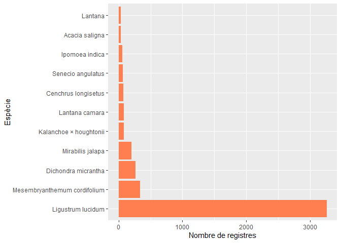

3AddicioDades
================
Erola Fenollosa
14/12/2021

## Introducció i descarrega de paquets

L'objectiu d'aquest script és incorporar, filtrar i completar el dataset amb noves dades d'altres fonts a part del projecte de iNaturalist per a completar el nombre de registres d'espècies susceptibles a ser invasores a la ciutat de Barcelona.

Carreguem els paquets necesaris:

``` r
library(tidyverse)
```

    ## Warning: package 'tidyverse' was built under R version 4.0.4

    ## -- Attaching packages --------------------------------------- tidyverse 1.3.0 --

    ## v ggplot2 3.3.3     v purrr   0.3.4
    ## v tibble  3.0.4     v dplyr   1.0.5
    ## v tidyr   1.1.2     v stringr 1.4.0
    ## v readr   1.4.0     v forcats 0.5.0

    ## Warning: package 'ggplot2' was built under R version 4.0.4

    ## Warning: package 'dplyr' was built under R version 4.0.4

    ## -- Conflicts ------------------------------------------ tidyverse_conflicts() --
    ## x dplyr::filter() masks stats::filter()
    ## x dplyr::lag()    masks stats::lag()

## Fonts de dades d'interès

Gràcies a la demanda creixent de Ciència Oberta, cada cop tenim a disposició més conjunts amb dades obertes. Per exemple, per a la ciutat de Barcelona, el portal *'Open Data Barcelona'*\[<https://opendata-ajuntament.barcelona.cat/ca/>\] acull més de 500 conjunts de dades amb informació de la ciutat. Entre elles, d'interés per aquest projecte trobem els següents conjunts de dades:

-   Arbrat dels parcs de la ciutat de Barcelona: <https://opendata-ajuntament.barcelona.cat/data/ca/dataset/arbrat-parcs>
-   Arbrat de zona de la ciutat de Barcelona: <https://opendata-ajuntament.barcelona.cat/data/ca/dataset/arbrat-zona>
-   Arbrat viari de la ciutat de Barcelona: <https://opendata-ajuntament.barcelona.cat/data/ca/dataset/arbrat-viari>

Amb aquestes dades podrem augmentar el nombre de registres d'espècies arbòries d'entre les espècies susceptibles a ser invasores, és a dir, els registres d'*Acacia saligna* i *Ligustrum lucidum*.

Altres fonts de dades que podrien ser d'interès per a complementar l'anàlisi en futurs anàlisis són:

-   Cobertura vegetal de la ciutat de Barcelona, a partir de l'índex NVDI <https://opendata-ajuntament.barcelona.cat/data/ca/dataset/cobertura-vegetal-ndvi>
-   Parcs i jardins de la ciutat de Barcelona <https://opendata-ajuntament.barcelona.cat/data/ca/dataset/culturailleure-parcsjardins>

## Obtenció de les dades

En primer lloc obtenim les dades dels portals esmentats. Ho podriem fer a través de l'API. De moment descarreguem el CSV i el guardem a la carpeta del projecte.

``` r
parcs <- read.csv(file = 'OpenDataBCN/OD_Arbrat_Parcs_BCN.csv')
zona <- read.csv(file = 'OpenDataBCN/OD_Arbrat_Viari_BCN.csv')
viari <- read.csv(file = 'OpenDataBCN/OD_Arbrat_Zona_BCN.csv')
```

Revisem de quines variables consta el dataset:

``` r
names(parcs)
```

    ##  [1] "codi"             "x_etrs89"         "y_etrs89"         "latitud"         
    ##  [5] "longitud"         "tipus_element"    "espai_verd"       "adreca"          
    ##  [9] "cat_especie_id"   "nom_cientific"    "nom_castella"     "nom_catala"      
    ## [13] "categoria_arbrat" "data_plantacio"   "tipus_aigua"      "tipus_reg"       
    ## [17] "geom"             "catalogacio"      "codi_barri"       "nom_barri"       
    ## [21] "codi_districte"   "nom_districte"

``` r
names(zona)
```

    ##  [1] "codi"             "x_etrs89"         "y_etrs89"         "latitud"         
    ##  [5] "longitud"         "tipus_element"    "espai_verd"       "adreca"          
    ##  [9] "cat_especie_id"   "nom_cientific"    "nom_castella"     "nom_catala"      
    ## [13] "categoria_arbrat" "data_plantacio"   "tipus_aigua"      "tipus_reg"       
    ## [17] "geom"             "catalogacio"      "codi_barri"       "nom_barri"       
    ## [21] "codi_districte"   "nom_districte"

``` r
names(viari)
```

    ##  [1] "codi"             "x_etrs89"         "y_etrs89"         "latitud"         
    ##  [5] "longitud"         "tipus_element"    "espai_verd"       "adreca"          
    ##  [9] "cat_especie_id"   "nom_cientific"    "nom_castella"     "nom_catala"      
    ## [13] "categoria_arbrat" "data_plantacio"   "tipus_aigua"      "tipus_reg"       
    ## [17] "geom"             "catalogacio"      "codi_barri"       "nom_barri"       
    ## [21] "codi_districte"   "nom_districte"

Els tres datasets tenen la mateixa estructura, podem unificar-los, indicant de quin dataset venia

``` r
# Afegim primer una variable que identifiqui el dataset d'origen:
parcs$TIPUS <- "PARCS"
zona$TIPUS <- "ZONA"
viari$TIPUS <- "VIARI"

arbratbcn <- rbind(rbind(parcs, zona), viari)
```

Mirem el dataset resultant:

``` r
head(arbratbcn)
```

    ##        codi x_etrs89 y_etrs89  latitud longitud tipus_element
    ## 1 0000023AR 430264.1  4587632 41.43723 2.165276    ARBRE PARC
    ## 2 0000024AR 430265.7  4587634 41.43725 2.165295    ARBRE PARC
    ## 3 0000026AR 430273.0  4587640 41.43730 2.165381    ARBRE PARC
    ## 4 0000027AR 430275.4  4587641 41.43732 2.165410    ARBRE PARC
    ## 5 0000029AR 430282.4  4587647 41.43736 2.165494    ARBRE PARC
    ## 6 0000030AR 430284.7  4587648 41.43738 2.165520    ARBRE PARC
    ##                    espai_verd               adreca cat_especie_id
    ## 1 Central de Nou Barris, Parc Pg Fabra i Puig, 450            152
    ## 2 Central de Nou Barris, Parc Pg Fabra i Puig, 450            152
    ## 3 Central de Nou Barris, Parc Pg Fabra i Puig, 450            152
    ## 4 Central de Nou Barris, Parc Pg Fabra i Puig, 450            152
    ## 5 Central de Nou Barris, Parc Pg Fabra i Puig, 450            152
    ## 6 Central de Nou Barris, Parc Pg Fabra i Puig, 450            152
    ##             nom_cientific   nom_castella       nom_catala categoria_arbrat
    ## 1 Populus nigra 'Italica' Chopo lombardo Pollancre gavatx           SEGONA
    ## 2 Populus nigra 'Italica' Chopo lombardo Pollancre gavatx           SEGONA
    ## 3 Populus nigra 'Italica' Chopo lombardo Pollancre gavatx           SEGONA
    ## 4 Populus nigra 'Italica' Chopo lombardo Pollancre gavatx           SEGONA
    ## 5 Populus nigra 'Italica' Chopo lombardo Pollancre gavatx           SEGONA
    ## 6 Populus nigra 'Italica' Chopo lombardo Pollancre gavatx           SEGONA
    ##   data_plantacio tipus_aigua      tipus_reg
    ## 1                            GOTEIG AVARIAT
    ## 2                            GOTEIG AVARIAT
    ## 3                            GOTEIG AVARIAT
    ## 4                            GOTEIG AVARIAT
    ## 5                            GOTEIG AVARIAT
    ## 6                            GOTEIG AVARIAT
    ##                                        geom catalogacio codi_barri    nom_barri
    ## 1  POINT (430264.091607904 4587632.3104902)                     48 LA GUINEUETA
    ## 2 POINT (430265.669623264 4587634.01248087)                     48 LA GUINEUETA
    ## 3  POINT (430272.952678578 4587639.8144346)                     48 LA GUINEUETA
    ## 4 POINT (430275.370695029 4587641.48841885)                     48 LA GUINEUETA
    ## 5  POINT (430282.40974435 4587646.55037329)                     48 LA GUINEUETA
    ## 6  POINT (430284.668760349 4587648.1973587)                     48 LA GUINEUETA
    ##   codi_districte nom_districte TIPUS
    ## 1              8    NOU BARRIS PARCS
    ## 2              8    NOU BARRIS PARCS
    ## 3              8    NOU BARRIS PARCS
    ## 4              8    NOU BARRIS PARCS
    ## 5              8    NOU BARRIS PARCS
    ## 6              8    NOU BARRIS PARCS

Revisem les dimensions del dataset

``` r
dim(arbratbcn)
```

    ## [1] 229238     23

## Neteja de les dades

Únicament ens interessen els registres d'espècies potencialment invasores del projecte. Busquem quines espècies hi ha al dataset:

``` r
unique(arbratbcn$nom_cientific)
```

    ##   [1] "Populus nigra 'Italica'"                         
    ##   [2] "Quercus ilex"                                    
    ##   [3] "Tipuana tipu"                                    
    ##   [4] "Populus alba 'pyramidalis'"                      
    ##   [5] "Cupressus sempervirens"                          
    ##   [6] "Morus alba 'Fruitless'"                          
    ##   [7] "Olea europaea"                                   
    ##   [8] "Ceratonia siliqua"                               
    ##   [9] "Tamarix africana"                                
    ##  [10] "Pinus halepensis"                                
    ##  [11] "Magnolia grandiflora"                            
    ##  [12] "Styphnolobium japonicum"                         
    ##  [13] "Diospyros virginiana"                            
    ##  [14] "Cercis siliquastrum"                             
    ##  [15] "Albizia julibrissin"                             
    ##  [16] "Ligustrum lucidum"                               
    ##  [17] "Citrus aurantium"                                
    ##  [18] "Ailanthus altissima"                             
    ##  [19] "Pinus pinea"                                     
    ##  [20] "Brachychiton populneus"                          
    ##  [21] "Acer negundo"                                    
    ##  [22] "Taxus baccata"                                   
    ##  [23] "Quercus suber"                                   
    ##  [24] "Phoenix canariensis"                             
    ##  [25] "Ginkgo biloba"                                   
    ##  [26] "Morus alba"                                      
    ##  [27] "Syagrus romanzoffiana"                           
    ##  [28] "Trachycarpus fortunei"                           
    ##  [29] "Phoenix dactylifera"                             
    ##  [30] "Livistona australis"                             
    ##  [31] "Butia yatay"                                     
    ##  [32] "Rhapis excelsa"                                  
    ##  [33] "Trithrinax campestris"                           
    ##  [34] "Laurus nobilis"                                  
    ##  [35] "Chitalpa x tashkentensis 'Minsum' SUMMER BELLS®"
    ##  [36] "Nerium oleander"                                 
    ##  [37] "Phytolacca dioica"                               
    ##  [38] "Populus x canadensis"                            
    ##  [39] "Jacaranda mimosifolia"                           
    ##  [40] "Ceiba speciosa"                                  
    ##  [41] "Eucalyptus globulus"                             
    ##  [42] "Eucalyptus tereticornis subsp. mediana"          
    ##  [43] "Eucalyptus pulchella"                            
    ##  [44] "Eucalyptus viminalis"                            
    ##  [45] "Eucalyptus erythrocorys"                         
    ##  [46] "Livistona chinensis"                             
    ##  [47] "Washingtonia robusta"                            
    ##  [48] "Washingtonia filifera"                           
    ##  [49] "Archontophoenix alexandrae"                      
    ##  [50] "Platanus x hispanica"                            
    ##  [51] "Cocculus laurifolius"                            
    ##  [52] "Casuarina cunninghamiana"                        
    ##  [53] "Cedrus deodara"                                  
    ##  [54] "Cupressus x leylandii"                           
    ##  [55] "Butia capitata"                                  
    ##  [56] "Cycas revoluta"                                  
    ##  [57] "Butyagrus nabonnandii"                           
    ##  [58] "Sabal mexicana"                                  
    ##  [59] "Howea forsteriana"                               
    ##  [60] "Phoenix reclinata"                               
    ##  [61] "Chamaerops humilis"                              
    ##  [62] "Brahea edulis"                                   
    ##  [63] "Arbutus unedo"                                   
    ##  [64] "Acacia saligna"                                  
    ##  [65] "Schinus molle"                                   
    ##  [66] "Yucca gigantea"                                  
    ##  [67] "Sabal mauritiiformis"                            
    ##  [68] "Trithrinax schizophylla"                         
    ##  [69] "Beaucarnea recurvata"                            
    ##  [70] "Brahea armata"                                   
    ##  [71] "Salix babylonica"                                
    ##  [72] "Brachychiton bidwillii"                          
    ##  [73] "Cupressus sempervirens 'Horizontalis'"           
    ##  [74] "Ulmus pumila var. arborea"                       
    ##  [75] "Robinia pseudoacacia"                            
    ##  [76] "Eucalyptus camaldulensis"                        
    ##  [77] "Melia azedarach"                                 
    ##  [78] "Tilia x euchlora"                                
    ##  [79] "Aesculus hippocastanum"                          
    ##  [80] "Lagunaria patersonia"                            
    ##  [81] "Acer campestre"                                  
    ##  [82] "Quercus robur"                                   
    ##  [83] "Tilia x europaea"                                
    ##  [84] "Platycladus orientalis"                          
    ##  [85] "Cupressus sempervirens 'Stricta'"                
    ##  [86] "Eriobotrya japonica"                             
    ##  [87] "Cupressus macrocarpa"                            
    ##  [88] "Pyrus calleryana 'Chanticleer'"                  
    ##  [89] "Prunus cerasifera 'Pissardii'"                   
    ##  [90] "Acacia longifolia"                               
    ##  [91] "Ligustrum lucidum 'Aureovariegatum'"             
    ##  [92] "Photinia nussia"                                 
    ##  [93] "Prunus cerasifera"                               
    ##  [94] "Gleditsia triacanthos f. 'Inermis'"              
    ##  [95] "Indeterminat Arbre"                              
    ##  [96] "Fraxinus berlanderiana"                          
    ##  [97] "Lagerstroemia indica"                            
    ##  [98] "Tilia tomentosa"                                 
    ##  [99] "Tilia cordata"                                   
    ## [100] "Prunus serrulata"                                
    ## [101] "Calocedrus decurrens"                            
    ## [102] "Parkinsonia aculeata"                            
    ## [103] "Grevillea robusta"                               
    ## [104] "Populus alba"                                    
    ## [105] "Celtis australis"                                
    ## [106] "Ficus microcarpa"                                
    ## [107] "Ficus benjamina"                                 
    ## [108] "Maclura pomifera"                                
    ## [109] "Koelreuteria paniculata"                         
    ## [110] "Corynocarpus laevigatus"                         
    ## [111] "Schefflera arboricola"                           
    ## [112] "Tamarix gallica"                                 
    ## [113] "Cupressus glabra 'Glauca'"                       
    ## [114] "Cephalotaxus harringtonia"                       
    ## [115] "Elaeagnus angustifolia"                          
    ## [116] "Platanus x hispanica 'Vallis Clausa' PLATANOR ®"
    ## [117] "Prunus serrulata 'Kanzan'"                       
    ## [118] "Pinus nigra subsp. salzmannii"                   
    ## [119] "Ficus binnendijkii"                              
    ## [120] "Fraxinus angustifolia"                           
    ## [121] "Fraxinus ornus"                                  
    ## [122] "Paulownia tomentosa"                             
    ## [123] "Brachychiton discolor"                           
    ## [124] "Schefflera elegantissima"                        
    ## [125] "Taxodium distichum"                              
    ## [126] "Ficus cyathistipula"                             
    ## [127] "Ficus elastica"                                  
    ## [128] "Ficus lyrata"                                    
    ## [129] "Fraxinus excelsior"                              
    ## [130] "Juglans regia"                                   
    ## [131] "Asparagus falcatus"                              
    ## [132] "Bursaria spinosa"                                
    ## [133] "Tilia americana"                                 
    ## [134] "Ficus rubiginosa"                                
    ## [135] "Podocarpus neriifolius"                          
    ## [136] "Quercus polymorpha"                              
    ## [137] "Schefflera actinophylla"                         
    ## [138] "Photinia davidiana"                              
    ## [139] "Schefflera arboricola 'Gold Capella'"            
    ## [140] "Catalpa bignonioides"                            
    ## [141] "Pinus canariensis"                               
    ## [142] "Laurus nobilis 'Crispa'"                         
    ## [143] "Crataegus x lavalleei 'Carrierei'"               
    ## [144] "Ficus benghalensis"                              
    ## [145] "Ficus macrophylla"                               
    ## [146] "Ilex aquifolium"                                 
    ## [147] "Manilkara zapota"                                
    ## [148] "Carissa macrocarpa"                              
    ## [149] "Prunus persica"                                  
    ## [150] "Ficus rubiginosa 'Australis'"                    
    ## [151] "Erythrina crista-galli"                          
    ## [152] "Psidium guajava"                                 
    ## [153] "Liquidambar styraciflua"                         
    ## [154] "Ostrya carpinifolia"                             
    ## [155] "Pittosporum tobira"                              
    ## [156] "Pterocarya × rehderiana"                        
    ## [157] "Yucca gloriosa"                                  
    ## [158] "Dracaena concinna 'Kunth'"                       
    ## [159] "Dypsis decaryi"                                  
    ## [160] "Chamaedorea elegans"                             
    ## [161] "Phoenix roebelenii"                              
    ## [162] "Zamia furfuracea"                                
    ## [163] "Dracaena draco"                                  
    ## [164] "Dasylirion acrotrichum"                          
    ## [165] "Caryota mitis"                                   
    ## [166] "Cycas circinalis"                                
    ## [167] "Yucca aloifolia"                                 
    ## [168] "Dypsis lutescens"                                
    ## [169] "Dioon edule"                                     
    ## [170] "Salix atrocinerea"                               
    ## [171] "Pistacia lentiscus"                              
    ## [172] "Quercus cerrioides"                              
    ## [173] "Quercus pubescens"                               
    ## [174] "Ulmus minor"                                     
    ## [175] "Sorbus domestica"                                
    ## [176] "Crataegus monogyna"                              
    ## [177] "Ligustrum japonicum"                             
    ## [178] "Zelkova serrata 'Flekova' GREEN BASE ®"         
    ## [179] "Ulmus pumila"                                    
    ## [180] "Broussonetia papyrifera"                         
    ## [181] "Quercus cerris"                                  
    ## [182] "Pistacia atlantica"                              
    ## [183] "Cedrus atlantica 'Glauca'"                       
    ## [184] "Acer pseudoplatanus"                             
    ## [185] "Sequoia sempervirens"                            
    ## [186] "Acer pseudoplatanus 'Atropurpureum'"             
    ## [187] "Myrtus communis"                                 
    ## [188] "Tilia platyphyllos"                              
    ## [189] "Photinia serratifolia"                           
    ## [190] "Punica granatum"                                 
    ## [191] "Ligustrum japonicum 'excelsum superbum'"         
    ## [192] "Styphnolobium japonicum 'Pendulum'"              
    ## [193] "Diospyros kaki"                                  
    ## [194] "Taxus baccata 'fastigiata'"                      
    ## [195] "Pyrus communis"                                  
    ## [196] "Ziziphus jujuba"                                 
    ## [197] "Prunus domestica"                                
    ## [198] "Prunus dulcis"                                   
    ## [199] "Hibiscus syriacus"                               
    ## [200] "Prunus avium"                                    
    ## [201] "Cedrus atlantica"                                
    ## [202] "Araucaria heterophylla"                          
    ## [203] "Malus sylvestris"                                
    ## [204] "Bauhinia forficata"                              
    ## [205] "Populus nigra"                                   
    ## [206] "Cydonia oblonga"                                 
    ## [207] "Ligustrum japonicum 'Texanum'"                   
    ## [208] "Celtis sinensis"                                 
    ## [209] "Firmiana simplex"                                
    ## [210] "Malus x purpurea"                                
    ## [211] "Ficus carica"                                    
    ## [212] "Populus simonii"                                 
    ## [213] "Pinus pinaster"                                  
    ## [214] "Gleditsia triacanthos"                           
    ## [215] "Vitex agnus-castus"                              
    ## [216] "Acacia retinodes"                                
    ## [217] "Styphnolobium japonicum 'Dot'"                   
    ## [218] "Persea americana"                                
    ## [219] "Archontophoenix cunninghamiana"                  
    ## [220] "Platanus orientalis"                             
    ## [221] "Acer monspessulanum"                             
    ## [222] "Prunus cerasus"                                  
    ## [223] "Tamarix ramosissima"                             
    ## [224] "Thuja occidentalis"                              
    ## [225] "Harpephyllum caffrum"                            
    ## [226] "Prunus cerasifera 'Nigra'"                       
    ## [227] "Cupressus glabra"                                
    ## [228] "Juniperus communis"                              
    ## [229] "Handroanthus heptaphyllus"                       
    ## [230] "Robinia pseudoacacia 'Pyramidalis'"              
    ## [231] "Liriodendron tulipifera"                         
    ## [232] "Robinia hispida"                                 
    ## [233] "Cotinus coggygria"                               
    ## [234] "Schinus lentiscifolius"                          
    ## [235] "Acacia dealbata"                                 
    ## [236] "Schinus terebinthifolia"                         
    ## [237] "Pinus sylvestris"                                
    ## [238] "Prunus mahaleb"                                  
    ## [239] "Citrus x limon"                                  
    ## [240] "Picea abies"                                     
    ## [241] "Prunus 'Accolade'"                               
    ## [242] "Salix alba"                                      
    ## [243] "Carpinus betulus"                                
    ## [244] "Laurus azorica"                                  
    ## [245] "Araucaria cunninghamii"                          
    ## [246] "Crataegus x ruscinonensis"                       
    ## [247] "Washingtonia sp"                                 
    ## [248] "Acacia kempeana"                                 
    ## [249] "Erythrina falcata"                               
    ## [250] "Enterolobium contortisiliquum"                   
    ## [251] "Thuja plicata"                                   
    ## [252] "Cedrus libani"                                   
    ## [253] "Radermachera sinica"                             
    ## [254] "Strelitzia nicolai"                              
    ## [255] "Callistemon viminalis"                           
    ## [256] "Pterocarya fraxinifolia"                         
    ## [257] "Acer x freemanii 'Autumn Blaze'"                 
    ## [258] "Ligustrum japonicum 'Variegatum'"                
    ## [259] "Rhamnus alaternus"                               
    ## [260] "Cryptomeria japonica"                            
    ## [261] "Photinia glabra"                                 
    ## [262] "Pittosporum undulatum"                           
    ## [263] "Tetraclinis articulata"                          
    ## [264] "Pinus radiata"                                   
    ## [265] "Quercus pyrenaica"                               
    ## [266] "Phillyrea angustifolia"                          
    ## [267] "Rhaphiolepis indica"                             
    ## [268] "Morus bombycis"                                  
    ## [269] "Eugenia uniflora"                                
    ## [270] "Salix caprea"                                    
    ## [271] "Castanea sativa"                                 
    ## [272] "Oreopanax capitatus"                             
    ## [273] "Citrus deliciosa"                                
    ## [274] "Ceiba chodatii"                                  
    ## [275] "Calocedrus decurrens 'aureovariegata'"           
    ## [276] "Brachychiton acerifolius"                        
    ## [277] "Poncirus trifoliata"                             
    ## [278] "Cedrus deodara 'Pendula'"                        
    ## [279] "Erythrina caffra"                                
    ## [280] "Picea glauca 'Conica'"                           
    ## [281] "Jasminum subhumile"                              
    ## [282] "Schinus molle var. areira"                       
    ## [283] "Alnus cordata"                                   
    ## [284] "Ficus drupacea"                                  
    ## [285] "Chamaecyparis lawsoniana"                        
    ## [286] "Nolina beldingii"                                
    ## [287] "Sabal minor"                                     
    ## [288] "Nannorrhops ritchiana"                           
    ## [289] "Yucca faxoniana"                                 
    ## [290] "Ficus elastica 'Decora Rubra'"                   
    ## [291] "Bauhinia purpurea"                               
    ## [292] "Callistemon citrinus 'Splendens'"                
    ## [293] "Juniperus horizontalis"                          
    ## [294] "Sambucus nigra"                                  
    ## [295] "Crataegus x media 'Paul's Scarlet'"              
    ## [296] "Koelreuteria paniculata 'Fastigiata'"            
    ## [297] "Acer platanoides"                                
    ## [298] "Celtis occidentalis"                             
    ## [299] "Morus nigra"                                     
    ## [300] "Ginkgo biloba 'Fastigiata'"                      
    ## [301] "Acer saccharinum"                                
    ## [302] "Quercus robur 'Fastigiata'"                      
    ## [303] "Juglans nigra"                                   
    ## [304] "Magnolia grandiflora 'Galissonnière'"           
    ## [305] "Araucaria bidwillii"                             
    ## [306] "Prunus armeniaca"                                
    ## [307] "Acer campestre 'Fastigiata'"                     
    ## [308] "Prunus padus"                                    
    ## [309] "Fraxinus angustifolia 'Raywood'"                 
    ## [310] "Robinia pseudoacacia 'Besoniana'"                
    ## [311] "Malus 'Evereste'"                                
    ## [312] "Casimiroa edulis"                                
    ## [313] "Dovyalis caffra"                                 
    ## [314] "Morus alba 'Pendula'"                            
    ## [315] "Ulmus glabra 'Pendula'"                          
    ## [316] "Schinus longifolius"                             
    ## [317] "Erythrina lysistemon"                            
    ## [318] "Toxicodendron succedaneum"                       
    ## [319] "Acacia caven"                                    
    ## [320] "Pistacia vera"                                   
    ## [321] "Acacia melanoxylon"                              
    ## [322] "Sapindus mukorossi"                              
    ## [323] "Pinus brutia"                                    
    ## [324] "Volkameria glabra"                               
    ## [325] "Ruprechtia apetala"                              
    ## [326] "Melaleuca armillaris"                            
    ## [327] "Eucalyptus gomphocephala"                        
    ## [328] "Elaeodendron croceum"                            
    ## [329] "Picconia excelsa"                                
    ## [330] "Carya illinoinensis"                             
    ## [331] "Juniperus virginiana"                            
    ## [332] "Pistacia atlantica subsp. mutica"                
    ## [333] "Agonis flexuosa"                                 
    ## [334] "Leucaena leucocephala"                           
    ## [335] "Melaleuca ericifolia"                            
    ## [336] "Punica granatum 'Nana'"                          
    ## [337] "Lithraea molleoides"                             
    ## [338] "Acacia verticillata"                             
    ## [339] "Podocarpus macrophyllus"                         
    ## [340] "Acer buergerianum"                               
    ## [341] "Fraxinus ornus 'Obelisk'"                        
    ## [342] "Brachychiton rupestris"                          
    ## [343] "Senegalia caffra"                                
    ## [344] "Ficus salicifolia"                               
    ## [345] "Cupressus lusitanica"                            
    ## [346] "Pinus nigra subsp. nigra"                        
    ## [347] "Mespilus germanica"                              
    ## [348] "Magnolia liliiflora"                             
    ## [349] "Tamarix chinensis"                               
    ## [350] "Brachychiton populneus subsp. trilobus"          
    ## [351] "Cupressus macrocarpa 'Globe'"                    
    ## [352] "Sequoiadendron giganteum"                        
    ## [353] "Dasylirion glaucophyllum"                        
    ## [354] "Senna spectabilis"                               
    ## [355] "Moringa oleifera"                                
    ## [356] "Plumeria rubra"                                  
    ## [357] "Schotia afra"                                    
    ## [358] "Schotia brachypetala"                            
    ## [359] "Xanthostemon chrysanthus"                        
    ## [360] "Viburnum opulus"                                 
    ## [361] "Aesculus x carnea"                               
    ## [362] "Corylus colurna"                                 
    ## [363] "Cercis siliquastrum 'Alba'"                      
    ## [364] "Pinus lambertiana"                               
    ## [365] "Cupressus cashmeriana"                           
    ## [366] "Metrosideros excelsa"                            
    ## [367] "Casuarina equisetifolia"                         
    ## [368] "Parrotia persica 'Vanessa'"                      
    ## [369] "Ginkgo biloba 'Fastigiata Blagon'"               
    ## [370] "Gleditsia triacanthos 'Skyline'"                 
    ## [371] "Gleditsia triacanthos 'Sunburst'"                
    ## [372] "Fraxinus ornus 'Mecsek'"                         
    ## [373] "Robinia pseudoacacia 'Casque rouge'"             
    ## [374] "Populus x canescens"                             
    ## [375] "Styphnolobium japonicum 'Columnare'"             
    ## [376] "Alnus glutinosa 'Pyramidalis'"                   
    ## [377] "Ulmus americana"                                 
    ## [378] "Ulmus 'New Horizon' RESISTA®"                   
    ## [379] "Photinia x fraseri 'Red Robin'"                  
    ## [380] "Acer platanoides 'Crimson King'"                 
    ## [381] "Fraxinus americana"                              
    ## [382] "Acer saccharinum 'Fastigiata'"                   
    ## [383] "Prunus serrulata Royal Burgundy"                 
    ## [384] "Acer campestre 'Elsrijk'"                        
    ## [385] "Magnolia grandiflora 'Goliath'"                  
    ## [386] "Ulmus minor 'Umbraculifera'"                     
    ## [387] "Acer platanoides 'Columnare'"                    
    ## [388] "Quercus rubra"                                   
    ## [389] "Robinia pseudoacacia 'Umbraculifera'"            
    ## [390] "Ulmus pumila 'Umbraculifera'"                    
    ## [391] "Ficus rubiginosa f. glabrescens"                 
    ## [392] "Ulmus 'Dodoens'"                                 
    ## [393] "Citrus aurantiifolia"                            
    ## [394] "Platanus x hispanica 'Alphen's Globe'"           
    ## [395] "Elaeagnus pungens"                               
    ## [396] "Ulmus 'Sapporo Autumn Gold'"                     
    ## [397] "Tecoma stans"                                    
    ## [398] "Catalpa bignonioides 'Nana'"                     
    ## [399] "Viburnum tinus"                                  
    ## [400] "Acer opalus"                                     
    ## [401] "Bauhinia variegata"                              
    ## [402] "Fraxinus pennsylvanica"                          
    ## [403] "Alnus glutinosa"                                 
    ## [404] "Ulmus parvifolia"                                
    ## [405] "Platanus orientalis 'Cuneata'"                   
    ## [406] "Acca sellowiana"                                 
    ## [407] "Parasenegalia visco"                             
    ## [408] "Pennisetum setaceum"                             
    ## [409] "Albizia julibrissin 'Ombrella'"                  
    ## [410] "Pistacia chinensis"                              
    ## [411] "Cercidiphyllum japonicum"                        
    ## [412] "Ligustrum ovalifolium"                           
    ## [413] "Nerium oleander (vermell)"                       
    ## [414] "Populus deltoides"                               
    ## [415] "Ulmus pumila 'Latifolia'"                        
    ## [416] "Morus alba 'Fastigiata'"                         
    ## [417] "Acacia baileyana"                                
    ## [418] "Photinia x fraseri"                              
    ## [419] "Betula pendula"                                  
    ## [420] "Pyrus calleryana"                                
    ## [421] "Salix matsudana 'Tortuosa'"                      
    ## [422] "Prunus subhirtella 'Autumnalis'"                 
    ## [423] "Hibiscus rosa-sinensis"                          
    ## [424] "Grevillea banksii"                               
    ## [425] "Sophora davidii"                                 
    ## [426] "Robinia × ambigua"                              
    ## [427] "Bauhinia variegata 'Candida'"                    
    ## [428] "Punica granatum 'Legrelleae'"                    
    ## [429] "Lophostemon confertus"                           
    ## [430] "Cinnamomum camphora"                             
    ## [431] "Citrus reticulata"                               
    ## [432] "Cercis siliquastrum 'Rosea'"                     
    ## [433] "Abies alba"                                      
    ## [434] "Quercus rotundifolia"                            
    ## [435] "Populus tremula 'Pendula'"                       
    ## [436] "Juniperus cedrus"                                
    ## [437] "Quercus faginea"                                 
    ## [438] "Prunus spinosa"                                  
    ## [439] "Abies x masjoannis"                              
    ## [440] "Cupressus funebris"                              
    ## [441] "Ekebergia capensis"                              
    ## [442] "Ruprechtia laxiflora"                            
    ## [443] "Populus tremula"                                 
    ## [444] "Ulmus glabra"                                    
    ## [445] "Pinus nigra"                                     
    ## [446] "Sambucus nigra 'Aureomarginata'"                 
    ## [447] "Pinus roxburghii"                                
    ## [448] "Salix x sepulcralis"                             
    ## [449] "Eucalyptus polyanthemos"                         
    ## [450] "Ligustrum sinensis"                              
    ## [451] "Schinus polygamus"                               
    ## [452] "Albizia julibrissin 'Summer Chocolate'"          
    ## [453] "Acer truncatum"                                  
    ## [454] "Osmanthus heterophyllus"                         
    ## [455] "Robinia pseudoacacia 'Microphylla'"              
    ## [456] "Abies pinsapo"                                   
    ## [457] "Yucca gloriosa var. recurvifolia"                
    ## [458] "Pistacia terebinthus"                            
    ## [459] "Phyllostachys nigra"                             
    ## [460] "Cistus albidus"                                  
    ## [461] "Salix eleagnos"                                  
    ## [462] "Citrus aurantium 'Amara'"                        
    ## [463] "Cedrus atlantica 'Pendula'"                      
    ## [464] "Cordyline australis"                             
    ## [465] "Tamarix ramosissima 'Pink Cascade'"              
    ## [466] "Ginkgo biloba 'Tremonia'"                        
    ## [467] "Magnolia stellata"

Per tant tal i com comentava abans, d'aquest dataset ens interesarà unicament els registres de *Ligustrum lucidum* i *Acacia saligna*. Filtrem el dataset:

``` r
arbratBCN_pot <- arbratbcn[arbratbcn$nom_cientific == c("Acacia saligna", "Ligustrum lucidum"),]
dim(arbratBCN_pot)
```

    ## [1] 3156   23

Ara tenim 3156 registres, d'aquestes dues espècies. Revisem quants registres hi ha de cadascuna:

``` r
arbratBCN_pot %>% count(nom_cientific, sort = TRUE)
```

    ##       nom_cientific    n
    ## 1 Ligustrum lucidum 3123
    ## 2    Acacia saligna   33

És important destacar que hi ha molts més registres de *Ligustrum lucidum* que no pas d'*Acacia saligna*.

## Unió amb el dataset de iNaturalist

Procedim a unir el dataset arbratBCN\_pot amb dades de Open Data BCN de localització de les espècies arbòries *L. lucidum* i *A. saligna* amb el dataset amb dades del projecte de iNaturalist que hem obtingut anteriorment.

Recarreguem el dataset net de iNaturalist (l'obtingut després de l'script 1Descarega):

``` r
actpnrfs <- read.csv(file = 'actpnrfs.csv')
```

Filtrem les variables d'interès d'ambdos datasets abans d'ajuntar-los i els unim, reanomenant les variables:

``` r
extres <- data.frame(latitud= arbratBCN_pot$latitud, longitud = arbratBCN_pot$longitud, taxon.name = arbratBCN_pot$nom_cientific)

actpnrf_net <- data.frame(latitud = actpnrfs$latitude, longitud = actpnrfs$longitude, taxon.name = actpnrfs$taxon.name) 
```

Ajuntem els datasets:

``` r
potinvasoresbcn <- rbind(actpnrf_net, extres)
head(potinvasoresbcn)
```

    ##    latitud longitud                   taxon.name
    ## 1 41.36851 2.094914               Ipomoea indica
    ## 2 41.42884 2.092528       Kalanchoe × houghtonii
    ## 3 41.36854 2.095732          Cenchrus longisetus
    ## 4 41.36699 2.095825               Ipomoea indica
    ## 5 41.36521 2.096114 Mesembryanthemum cordifolium
    ## 6 41.41547 2.094604               Ipomoea indica

## Nou mapa global i recompte de registres totals

Fem el recompte de registres totals i sobretot de registres per espècie:

``` r
potinvasoresbcn %>% count(taxon.name, sort = TRUE)
```

    ##                      taxon.name    n
    ## 1             Ligustrum lucidum 3257
    ## 2  Mesembryanthemum cordifolium  336
    ## 3           Dichondra micrantha  266
    ## 4              Mirabilis jalapa  200
    ## 5        Kalanchoe × houghtonii   86
    ## 6                Lantana camara   83
    ## 7           Cenchrus longisetus   79
    ## 8             Senecio angulatus   66
    ## 9                Ipomoea indica   60
    ## 10               Acacia saligna   33
    ## 11                      Lantana   32

``` r
ggplot(potinvasoresbcn,aes(x = fct_infreq(taxon.name))) + 
    geom_bar(stat = 'count', fill = "coral")+ coord_flip() + xlab("Espècie")+ ylab("Nombre de registres")
```



Nombre total de registres:

``` r
print(paste("El nombre de registres actual (En data:", Sys.Date(), ") del projecte addicionant les dades de OpenDataBCN és: ", dim(potinvasoresbcn)[1]))
```

    ## [1] "El nombre de registres actual (En data: 2021-12-21 ) del projecte addicionant les dades de OpenDataBCN és:  4498"

Grafiquem els registres repetint l'anàlisi per districtes tal i com hem fet en el script 2 (CalculDensitats):

``` r
# CAl reentrar els poligons i repetir
```
