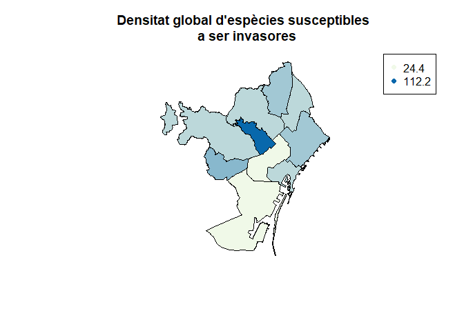

3AddicioDades
================
Erola Fenollosa
14/12/2021

## Introducció i descarrega de paquets

L'objectiu d'aquest script és incorporar, filtrar i completar el dataset amb noves dades d'altres fonts a part del projecte de iNaturalist per a completar el nombre de registres d'espècies susceptibles a ser invasores a la ciutat de Barcelona.

Carreguem els paquets necesaris:

``` r
library(tidyverse)
library(raster)
library(sf)
```

## Fonts de dades d'interès

Gràcies a la demanda creixent de Ciència Oberta, cada cop tenim a disposició més conjunts amb dades obertes. Per exemple, per a la ciutat de Barcelona, el portal *'Open Data Barcelona'*\[<https://opendata-ajuntament.barcelona.cat/ca/>\] acull més de 500 conjunts de dades amb informació de la ciutat. Entre elles, d'interés per aquest projecte trobem els següents conjunts de dades:

-   Arbrat dels parcs de la ciutat de Barcelona: <https://opendata-ajuntament.barcelona.cat/data/ca/dataset/arbrat-parcs>
-   Arbrat de zona de la ciutat de Barcelona: <https://opendata-ajuntament.barcelona.cat/data/ca/dataset/arbrat-zona>
-   Arbrat viari de la ciutat de Barcelona: <https://opendata-ajuntament.barcelona.cat/data/ca/dataset/arbrat-viari>

Amb aquestes dades podrem augmentar el nombre de registres d'espècies arbòries d'entre les espècies susceptibles a ser invasores, és a dir, els registres d'*Acacia saligna* i *Ligustrum lucidum*.

Altres fonts de dades que podrien ser d'interès per a complementar l'anàlisi en futurs anàlisis són:

-   Cobertura vegetal de la ciutat de Barcelona, a partir de l'índex NVDI <https://opendata-ajuntament.barcelona.cat/data/ca/dataset/cobertura-vegetal-ndvi>
-   Parcs i jardins de la ciutat de Barcelona <https://opendata-ajuntament.barcelona.cat/data/ca/dataset/culturailleure-parcsjardins>

## Obtenció de les dades

En primer lloc obtenim les dades dels portals esmentats. Ho podriem fer a través de l'API. De moment descarreguem el CSV i el guardem a la carpeta del projecte.

``` r
parcs <- read.csv(file = 'OpenDataBCN/OD_Arbrat_Parcs_BCN.csv')
zona <- read.csv(file = 'OpenDataBCN/OD_Arbrat_Viari_BCN.csv')
viari <- read.csv(file = 'OpenDataBCN/OD_Arbrat_Zona_BCN.csv')
```

Revisem de quines variables consta el dataset:

``` r
names(parcs)
```

    ##  [1] "codi"             "x_etrs89"         "y_etrs89"         "latitud"         
    ##  [5] "longitud"         "tipus_element"    "espai_verd"       "adreca"          
    ##  [9] "cat_especie_id"   "nom_cientific"    "nom_castella"     "nom_catala"      
    ## [13] "categoria_arbrat" "data_plantacio"   "tipus_aigua"      "tipus_reg"       
    ## [17] "geom"             "catalogacio"      "codi_barri"       "nom_barri"       
    ## [21] "codi_districte"   "nom_districte"

``` r
names(zona)
```

    ##  [1] "codi"             "x_etrs89"         "y_etrs89"         "latitud"         
    ##  [5] "longitud"         "tipus_element"    "espai_verd"       "adreca"          
    ##  [9] "cat_especie_id"   "nom_cientific"    "nom_castella"     "nom_catala"      
    ## [13] "categoria_arbrat" "data_plantacio"   "tipus_aigua"      "tipus_reg"       
    ## [17] "geom"             "catalogacio"      "codi_barri"       "nom_barri"       
    ## [21] "codi_districte"   "nom_districte"

``` r
names(viari)
```

    ##  [1] "codi"             "x_etrs89"         "y_etrs89"         "latitud"         
    ##  [5] "longitud"         "tipus_element"    "espai_verd"       "adreca"          
    ##  [9] "cat_especie_id"   "nom_cientific"    "nom_castella"     "nom_catala"      
    ## [13] "categoria_arbrat" "data_plantacio"   "tipus_aigua"      "tipus_reg"       
    ## [17] "geom"             "catalogacio"      "codi_barri"       "nom_barri"       
    ## [21] "codi_districte"   "nom_districte"

Els tres datasets tenen la mateixa estructura, podem unificar-los, indicant de quin dataset venia

``` r
# Afegim primer una variable que identifiqui el dataset d'origen:
parcs$TIPUS <- "PARCS"
zona$TIPUS <- "ZONA"
viari$TIPUS <- "VIARI"

arbratbcn <- rbind(rbind(parcs, zona), viari)
```

Mirem el dataset resultant:

``` r
head(arbratbcn)
```

    ##        codi x_etrs89 y_etrs89  latitud longitud tipus_element
    ## 1 0000023AR 430264.1  4587632 41.43723 2.165276    ARBRE PARC
    ## 2 0000024AR 430265.7  4587634 41.43725 2.165295    ARBRE PARC
    ## 3 0000026AR 430273.0  4587640 41.43730 2.165381    ARBRE PARC
    ## 4 0000027AR 430275.4  4587641 41.43732 2.165410    ARBRE PARC
    ## 5 0000029AR 430282.4  4587647 41.43736 2.165494    ARBRE PARC
    ## 6 0000030AR 430284.7  4587648 41.43738 2.165520    ARBRE PARC
    ##                    espai_verd               adreca cat_especie_id
    ## 1 Central de Nou Barris, Parc Pg Fabra i Puig, 450            152
    ## 2 Central de Nou Barris, Parc Pg Fabra i Puig, 450            152
    ## 3 Central de Nou Barris, Parc Pg Fabra i Puig, 450            152
    ## 4 Central de Nou Barris, Parc Pg Fabra i Puig, 450            152
    ## 5 Central de Nou Barris, Parc Pg Fabra i Puig, 450            152
    ## 6 Central de Nou Barris, Parc Pg Fabra i Puig, 450            152
    ##             nom_cientific   nom_castella       nom_catala categoria_arbrat
    ## 1 Populus nigra 'Italica' Chopo lombardo Pollancre gavatx           SEGONA
    ## 2 Populus nigra 'Italica' Chopo lombardo Pollancre gavatx           SEGONA
    ## 3 Populus nigra 'Italica' Chopo lombardo Pollancre gavatx           SEGONA
    ## 4 Populus nigra 'Italica' Chopo lombardo Pollancre gavatx           SEGONA
    ## 5 Populus nigra 'Italica' Chopo lombardo Pollancre gavatx           SEGONA
    ## 6 Populus nigra 'Italica' Chopo lombardo Pollancre gavatx           SEGONA
    ##   data_plantacio tipus_aigua      tipus_reg
    ## 1                            GOTEIG AVARIAT
    ## 2                            GOTEIG AVARIAT
    ## 3                            GOTEIG AVARIAT
    ## 4                            GOTEIG AVARIAT
    ## 5                            GOTEIG AVARIAT
    ## 6                            GOTEIG AVARIAT
    ##                                        geom catalogacio codi_barri    nom_barri
    ## 1  POINT (430264.091607904 4587632.3104902)                     48 LA GUINEUETA
    ## 2 POINT (430265.669623264 4587634.01248087)                     48 LA GUINEUETA
    ## 3  POINT (430272.952678578 4587639.8144346)                     48 LA GUINEUETA
    ## 4 POINT (430275.370695029 4587641.48841885)                     48 LA GUINEUETA
    ## 5  POINT (430282.40974435 4587646.55037329)                     48 LA GUINEUETA
    ## 6  POINT (430284.668760349 4587648.1973587)                     48 LA GUINEUETA
    ##   codi_districte nom_districte TIPUS
    ## 1              8    NOU BARRIS PARCS
    ## 2              8    NOU BARRIS PARCS
    ## 3              8    NOU BARRIS PARCS
    ## 4              8    NOU BARRIS PARCS
    ## 5              8    NOU BARRIS PARCS
    ## 6              8    NOU BARRIS PARCS

Revisem les dimensions del dataset

``` r
dim(arbratbcn)
```

    ## [1] 229238     23

## Neteja de les dades

Únicament ens interessen els registres d'espècies potencialment invasores del projecte. Busquem quines espècies hi ha al dataset:

``` r
head(unique(arbratbcn$nom_cientific))
```

    ## [1] "Populus nigra 'Italica'"    "Quercus ilex"              
    ## [3] "Tipuana tipu"               "Populus alba 'pyramidalis'"
    ## [5] "Cupressus sempervirens"     "Morus alba 'Fruitless'"

Per tant tal i com comentava abans, d'aquest dataset ens interesarà unicament els registres de *Ligustrum lucidum* i *Acacia saligna*. Filtrem el dataset:

``` r
arbratBCN_pot <- arbratbcn[arbratbcn$nom_cientific == c("Acacia saligna", "Ligustrum lucidum"),]
dim(arbratBCN_pot)
```

    ## [1] 3156   23

Ara tenim 3156 registres, d'aquestes dues espècies. Revisem quants registres hi ha de cadascuna:

``` r
arbratBCN_pot %>% count(nom_cientific, sort = TRUE)
```

    ##       nom_cientific    n
    ## 1 Ligustrum lucidum 3123
    ## 2    Acacia saligna   33

És important destacar que hi ha molts més registres de *Ligustrum lucidum* que no pas d'*Acacia saligna*.

## Unió amb el dataset de iNaturalist

Procedim a unir el dataset arbratBCN\_pot amb dades de Open Data BCN de localització de les espècies arbòries *L. lucidum* i *A. saligna* amb el dataset amb dades del projecte de iNaturalist que hem obtingut anteriorment.

Recarreguem el dataset net de iNaturalist (l'obtingut després de l'script 1Descarega):

``` r
actpnrfs <- read.csv(file = 'actpnrfs.csv')
```

Filtrem les variables d'interès d'ambdos datasets abans d'ajuntar-los i els unim, reanomenant les variables:

``` r
extres <- data.frame(latitud= arbratBCN_pot$latitud, longitud = arbratBCN_pot$longitud, taxon.name = arbratBCN_pot$nom_cientific)

actpnrf_net <- data.frame(latitud = actpnrfs$latitude, longitud = actpnrfs$longitude, taxon.name = actpnrfs$taxon.name) 
```

Ajuntem els datasets:

``` r
potinvasoresbcn <- rbind(actpnrf_net, extres)
head(potinvasoresbcn)
```

    ##    latitud longitud                   taxon.name
    ## 1 41.36851 2.094914               Ipomoea indica
    ## 2 41.42884 2.092528       Kalanchoe × houghtonii
    ## 3 41.36854 2.095732          Cenchrus longisetus
    ## 4 41.36699 2.095825               Ipomoea indica
    ## 5 41.36521 2.096114 Mesembryanthemum cordifolium
    ## 6 41.41547 2.094604               Ipomoea indica

## Nou mapa global i recompte de registres totals

Fem el recompte de registres totals i sobretot de registres per espècie:

``` r
potinvasoresbcn %>% count(taxon.name, sort = TRUE)
```

    ##                      taxon.name    n
    ## 1             Ligustrum lucidum 3257
    ## 2  Mesembryanthemum cordifolium  336
    ## 3           Dichondra micrantha  266
    ## 4              Mirabilis jalapa  200
    ## 5        Kalanchoe × houghtonii   86
    ## 6                Lantana camara   83
    ## 7           Cenchrus longisetus   79
    ## 8             Senecio angulatus   66
    ## 9                Ipomoea indica   60
    ## 10               Acacia saligna   33
    ## 11                      Lantana   32

``` r
ggplot(potinvasoresbcn,aes(x = fct_infreq(taxon.name))) + 
    geom_bar(stat = 'count', fill = "coral")+ coord_flip() + xlab("Espècie")+ ylab("Nombre de registres")
```


Nombre total de registres:

``` r
print(paste("El nombre de registres actual (En data:", Sys.Date(), ") del projecte addicionant les dades de OpenDataBCN és: ", dim(potinvasoresbcn)[1]))
```

    ## [1] "El nombre de registres actual (En data: 2021-12-21 ) del projecte addicionant les dades de OpenDataBCN és:  4498"

Grafiquem els registres repetint l'anàlisi per districtes tal i com hem fet en el script 2 (CalculDensitats (<https://github.com/erolafr/Actuem_a_temps_BCN/blob/main/2CalculDensitats.md>)). En primer lloc comptabilitzem registres i calculem la densitat global i per a cada espècie:

``` r
# transformem el dataset per a poder fer analisis espaials
inat_obs_sf <-  potinvasoresbcn %>% 
  st_as_sf(coords=c("longitud", "latitud"), crs=4326)

# filtrem els registres de bscb
barcelones <- st_read('shapefiles_catalunya_comarcas/shapefiles_catalunya_comarcas.shp')
```

    ## Reading layer `shapefiles_catalunya_comarcas' from data source 
    ##   `C:\Users\Erola\Documents\Actuem_a_temps_BCN\shapefiles_catalunya_comarcas\shapefiles_catalunya_comarcas.shp' 
    ##   using driver `ESRI Shapefile'
    ## Simple feature collection with 1 feature and 5 fields
    ## Geometry type: MULTIPOLYGON
    ## Dimension:     XY
    ## Bounding box:  xmin: 2.052651 ymin: 41.31702 xmax: 2.269917 ymax: 41.49271
    ## Geodetic CRS:  WGS 84

``` r
inat_obs_pcsp_sf  <- inat_obs_sf %>% st_intersection(barcelones)
nrow(inat_obs_pcsp_sf)
```

    ## [1] 4495

``` r
# calculem la densitat total de registres a barcelona:
barcelones_sp <- shapefile('shapefiles_catalunya_comarcas/shapefiles_catalunya_comarcas.shp')
print(paste("El nombre de registres actual al Barcelonès (En data:", Sys.Date(), ") és: ", round(nrow(inat_obs_pcsp_sf)/(area(barcelones_sp)/1000000),3), "registres/km2"))
```

    ## [1] "El nombre de registres actual al Barcelonès (En data: 2021-12-21 ) és:  30.707 registres/km2"

``` r
# Densitat total de cada espècie:
dens <- as.data.frame(inat_obs_pcsp_sf %>% count(taxon.name, sort = TRUE))
dens <- subset(dens, select = -c(geometry))
dens$densitat.global <- round(dens$n/(area(barcelones_sp)/1000000),3)
dens
```

    ##                      taxon.name    n densitat.global
    ## 1             Ligustrum lucidum 3257          22.250
    ## 2  Mesembryanthemum cordifolium  336           2.295
    ## 3           Dichondra micrantha  266           1.817
    ## 4              Mirabilis jalapa  200           1.366
    ## 5        Kalanchoe × houghtonii   86           0.587
    ## 6                Lantana camara   83           0.567
    ## 7           Cenchrus longisetus   78           0.533
    ## 8             Senecio angulatus   65           0.444
    ## 9                Ipomoea indica   59           0.403
    ## 10               Acacia saligna   33           0.225
    ## 11                      Lantana   32           0.219

Ara calculem les densitats per districte:

``` r
# descarreguem altre cop els poligons dels districtes:
districtes <- shapefile('CartoBCN-2021-dic-16-163718/Unitats Administratives/SHP/BCN_UNITATS_ADM/0301040100_Districtes_UNITATS_ADM.shp')
ciutatvella<- st_read('Districtes/ciutatvella/shapefiles_barcelona_distrito.shp')
eixample <- st_read('Districtes/eixample/shapefiles_barcelona_distrito.shp')
santsmontjuic <- st_read('Districtes/SantsMontjuic/shapefiles_barcelona_distrito.shp')
lescorts <- st_read('Districtes/lescorts/shapefiles_barcelona_distrito.shp')
sarriasantgervasi <- st_read('Districtes/sarriasantgervasi/shapefiles_barcelona_distrito.shp')
# gracia <- st_read('Districtes/gracia/shapefiles_barcelona_distrito.shp')
hortaguinardo <- st_read('Districtes/hortaguinardo/shapefiles_barcelona_distrito.shp')
noubarris<- st_read('Districtes/Nou_Barris/shapefiles_barcelona_distrito.shp')
santandreu<- st_read('Districtes/santandreu/shapefiles_barcelona_distrito.shp')
santmarti<- st_read('Districtes/santmarti/shapefiles_barcelona_distrito.shp')

arees<- data.frame(codi_districte = districtes$DISTRICTE, nom_districte = c("Ciutat Vella", "L'Eixample", "Sants-Montjuic", "Les Corts", "Sarrià - Sant Gervasi", "Gràcia", "Horta-Guinardó", "Nou Barris", "Sant Andreu", "Sant Martí") , area = area(districtes)/1000000)

# afegim la funció per a comptar registres:
num_registres <- function(area, inatdf) {
  inat_obs_pcsp_sf  <- inatdf %>% st_intersection(area)
  return(nrow(inat_obs_pcsp_sf))
} 

# comptem registres:
arees$registres<- as.numeric(c(num_registres(ciutatvella, inat_obs_pcsp_sf),
                    num_registres(eixample, inat_obs_pcsp_sf),
                    num_registres(santsmontjuic, inat_obs_pcsp_sf),
                    num_registres(lescorts, inat_obs_pcsp_sf),
                    num_registres(sarriasantgervasi, inat_obs_pcsp_sf),
                    NA,
                    num_registres(hortaguinardo, inat_obs_pcsp_sf),
                    num_registres(noubarris, inat_obs_pcsp_sf),
                    num_registres(santandreu, inat_obs_pcsp_sf),
                    num_registres(santmarti, inat_obs_pcsp_sf)))

arees$registres[6] <- nrow(inat_obs_pcsp_sf) - sum(arees$registres, na.rm = TRUE)
arees$densitat.global <- arees$registres/arees$area
```

Mostrem els resultats de densitat global per espècie ordenats:

``` r
arees[order(arees$densitat.global),]
```

    ##    codi_districte         nom_districte      area registres densitat.global
    ## 2              02            L'Eixample  7.464303       182        24.38272
    ## 3              03        Sants-Montjuic 22.879850       576        25.17499
    ## 7              07        Horta-Guinardó 11.919631       510        42.78656
    ## 5              05 Sarrià - Sant Gervasi 19.915566       856        42.98145
    ## 9              09           Sant Andreu  6.592480       302        45.80977
    ## 1              01          Ciutat Vella  4.204931       199        47.32539
    ## 10             10            Sant Martí 10.436698       559        53.56100
    ## 8              08            Nou Barris  8.056468       439        54.49038
    ## 4              04             Les Corts  6.010769       402        66.87996
    ## 6              06                Gràcia  4.224278       470       111.26162

Ara calculem la densitat per districte per a cada espècie, redefinim la funció per a fer-ho:

``` r
num_registres_especie <- function(especie) {
  registres_sp <- as.numeric(c(num_registres(ciutatvella, inat_obs_pcsp_sf[inat_obs_pcsp_sf$taxon.name==especie,]),
                    num_registres(eixample, inat_obs_pcsp_sf[inat_obs_pcsp_sf$taxon.name==especie,]),
                    num_registres(santsmontjuic, inat_obs_pcsp_sf[inat_obs_pcsp_sf$taxon.name==especie,]),
                    num_registres(lescorts, inat_obs_pcsp_sf[inat_obs_pcsp_sf$taxon.name==especie,]),
                    num_registres(sarriasantgervasi, inat_obs_pcsp_sf[inat_obs_pcsp_sf$taxon.name==especie,]),
                    NA,
                    num_registres(hortaguinardo, inat_obs_pcsp_sf[inat_obs_pcsp_sf$taxon.name==especie,]),
                    num_registres(noubarris, inat_obs_pcsp_sf[inat_obs_pcsp_sf$taxon.name==especie,]),
                    num_registres(santandreu, inat_obs_pcsp_sf[inat_obs_pcsp_sf$taxon.name==especie,]),
                    num_registres(santmarti, inat_obs_pcsp_sf[inat_obs_pcsp_sf$taxon.name==especie,])))
  registres_sp[6] <- nrow(inat_obs_pcsp_sf[inat_obs_pcsp_sf$taxon.name==especie,]) - sum(registres_sp, na.rm = TRUE)
  return(registres_sp)
} 

# Calculem les densitats, aquest cop tenim també Acacia saligna
d_aptenia <- num_registres_especie("Mesembryanthemum cordifolium")/arees$area
d_dichondra <- num_registres_especie("Dichondra micrantha")/arees$area
d_mirabilis <- num_registres_especie("Mirabilis jalapa")/arees$area
d_ligustrum <- num_registres_especie("Ligustrum lucidum")/arees$area
d_kalanchoe <- num_registres_especie("Kalanchoe × houghtonii")/arees$area
d_lantana <- num_registres_especie("Lantana camara")/arees$area
d_cenchrus <- num_registres_especie("Cenchrus longisetus")/arees$area
d_senecio <- num_registres_especie("Senecio angulatus")/arees$area
d_ipomoea <- num_registres_especie("Ipomoea indica")/arees$area
d_acacia <- num_registres_especie("Acacia saligna")/arees$area
```

Grafiquem-ho:

``` r
rbPal <- colorRampPalette(c('#a5d96a','#d7191c'))
par(mfrow=c(2,3))

datcol <- rbPal(100)[as.numeric(cut(d_aptenia,breaks = 100))]
plot(districtes, col=datcol, main = "Aptenia cordifolia \n per km2")
legend('bottomleft', legend=c(round(min(d_aptenia),2), round(max(d_aptenia),2)), col=c("#a5d96a","#d7191c"), pch=16)

datcol <- rbPal(100)[as.numeric(cut(d_dichondra,breaks = 100))]
plot(districtes, col=datcol, main = "Dichondra micrantha \n per km2")
legend('bottomleft', legend=c(round(min(d_dichondra),2), round(max(d_dichondra),2)), col=c("#a5d96a","#d7191c"), pch=16)

datcol <- rbPal(100)[as.numeric(cut(d_mirabilis,breaks = 100))]
plot(districtes, col=datcol, main = "Mirabilis jalapa \n per km2")
legend('bottomleft', legend=c(round(min(d_mirabilis),2), round(max(d_mirabilis),2)), col=c("#a5d96a","#d7191c"), pch=16)

datcol <- rbPal(100)[as.numeric(cut(d_ligustrum,breaks = 100))]
plot(districtes, col=datcol, main = "Ligustrum lucidum \n per km2")
legend('bottomleft', legend=c(round(min(d_ligustrum),2), round(max(d_ligustrum),2)), col=c("#a5d96a","#d7191c"), pch=16)

datcol <- rbPal(100)[as.numeric(cut(d_kalanchoe,breaks = 100))]
plot(districtes, col=datcol, main = "Kalanchoe × houghtonii \n per km2")
legend('bottomleft', legend=c(round(min(d_kalanchoe),2), round(max(d_kalanchoe),2)), col=c("#a5d96a","#d7191c"), pch=16)

datcol <- rbPal(100)[as.numeric(cut(d_lantana,breaks = 100))]
plot(districtes, col=datcol, main = "Lantana camara \n per km2")
legend('bottomleft', legend=c(round(min(d_lantana),2), round(max(d_lantana),2)), col=c("#a5d96a","#d7191c"), pch=16)
```


``` r
par(mfrow=c(2,2))

datcol <- rbPal(100)[as.numeric(cut(d_cenchrus,breaks = 100))]
plot(districtes, col=datcol, main = "Cenchrus longisetus \n per km2")
legend('bottomleft', legend=c(round(min(d_cenchrus),2), round(max(d_cenchrus),2)), col=c("#a5d96a","#d7191c"), pch=16)

datcol <- rbPal(100)[as.numeric(cut(d_senecio,breaks = 100))]
plot(districtes, col=datcol, main = "Senecio angulatus \n per km2")
legend('bottomleft', legend=c(round(min(d_senecio),2), round(max(d_senecio),2)), col=c("#a5d96a","#d7191c"), pch=16)

datcol <- rbPal(100)[as.numeric(cut(d_ipomoea,breaks = 100))]
plot(districtes, col=datcol, main = "Ipomoea indica \n per km2")
legend('bottomleft', legend=c(round(min(d_ipomoea),2), round(max(d_ipomoea),2)), col=c("#a5d96a","#d7191c"), pch=16)


datcol <- rbPal(100)[as.numeric(cut(d_acacia,breaks = 100))]
plot(districtes, col=datcol, main = "Acacia saligna \n per km2")
legend('bottomleft', legend=c(round(min(d_acacia),2), round(max(d_acacia),2)), col=c("#a5d96a","#d7191c"), pch=16)
```


