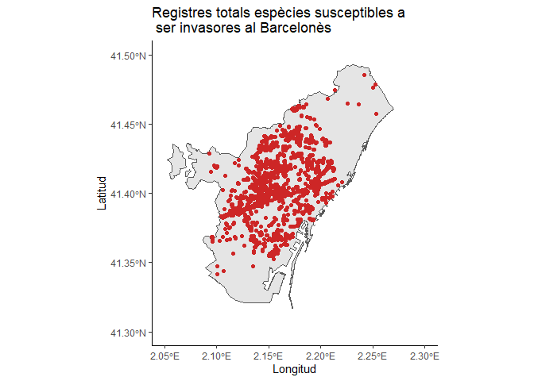
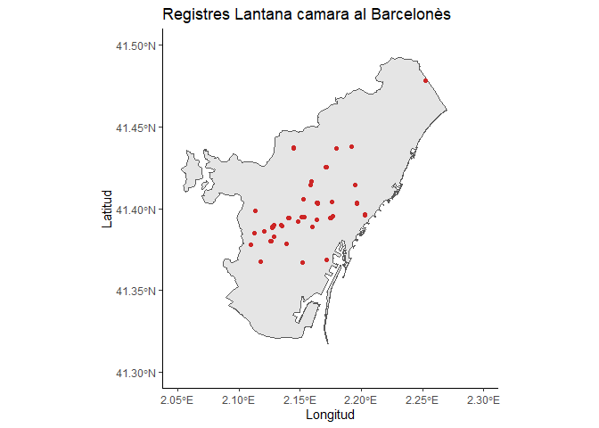
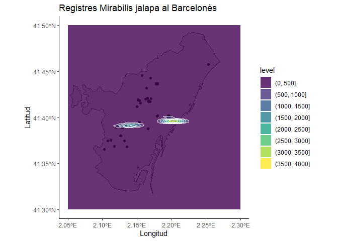

4MapesDensitatsFinals
================
ErolaFenollosa
22 desembre de 2021

## Introducció i descarrega de paquets

L'objectiu d'aquest script és construir mapes de densitat de registres amb el dataset filtrat i unit que hem generat en els darrers scripts, a través de descarregar les dades del projecte de iNaturalist i unides a les dades de arbrat de Barcelona.

Carreguem els paquets necesaris:

``` r
library(tidyverse)
library(raster)
library(sf)
library(hexbin)
library(RColorBrewer)
```

Importem les dades generades al final de l'script 3:

``` r
actdf <- read.csv(file = 'Datasets/xy_act_iNat_OpenData.csv')
actdf = subset(actdf, select = -c(X))
head(actdf)
```

    ##    latitud longitud     taxon.name
    ## 1 41.40136 2.211263 Acacia saligna
    ## 2 41.39943 2.208747 Acacia saligna
    ## 3 41.40143 2.211312 Acacia saligna
    ## 4 41.39942 2.208807 Acacia saligna
    ## 5 41.40591 2.216637 Acacia saligna
    ## 6 41.41883 2.147123 Acacia saligna

Generarem quatre tipus de mapes de registres i densitats: - 1. Mapa global de registres: Mapa dels registres totals de les 10 espècies susceptibles a ser invasores a la ciutat de Barcelona obtingudes de iNaturalist i de l'arbrat de Barcelona processats - 2. Mapa global de densitat: Mapa de densitat del conjunt de les 10 espècies susceptibles a ser invasores a la ciutat de Barcelona obtingudes de iNaturalist i de l'arbrat de Barcelona processats, estimant la densitat amb KDE. - 3. Mapes per espècie de registres: Mapa de registres com 1 però per a cadascuna de les 10 espècies susceptibles a ser invasores a la ciutat de Barcelona. - 4. Mapes per espècie de densitat: Mapa de densitat com 2 però per a cadascuna de les 10 espècies susceptibles a ser invasores a la ciutat de Barcelona.

### 1. Mapa global de registres

En primer lloc preparem el mapa global de registres, importem el poligon del Barcelonés com a referència:

``` r
barcelones <- st_read('Cartografia/shapefiles_catalunya_comarcas/shapefiles_catalunya_comarcas.shp')
```

    ## Reading layer `shapefiles_catalunya_comarcas' from data source 
    ##   `C:\Users\Erola\Documents\Actuem_a_temps_BCN\Cartografia\shapefiles_catalunya_comarcas\shapefiles_catalunya_comarcas.shp' 
    ##   using driver `ESRI Shapefile'
    ## Simple feature collection with 1 feature and 5 fields
    ## Geometry type: MULTIPOLYGON
    ## Dimension:     XY
    ## Bounding box:  xmin: 2.052651 ymin: 41.31702 xmax: 2.269917 ymax: 41.49271
    ## Geodetic CRS:  WGS 84

Grafiquem els registres amb la capa de Barcelona:

``` r
ggplot() +
 geom_sf(data = barcelones)+
  geom_point(aes(x = actdf$longitud, y = actdf$latitud), col = "firebrick3") +
  xlim(2.05, 2.30) +
  ylim(41.30, 41.50) + 
  ggtitle("Registres totals espècies susceptibles a \n ser invasores al Barcelonès") +
  xlab("Longitud") + ylab("Latitud") + theme_classic() 
```



En aquest mapa global podem veure les diferents espècies:

``` r
ggplot() +
 geom_sf(data = barcelones)+
  geom_point(aes(x = actdf$longitud, y = actdf$latitud, col= actdf$taxon.name)) +
  xlim(2.05, 2.30) +
  ylim(41.30, 41.50) + 
  ggtitle("Registres totals espècies susceptibles a \n ser invasores al Barcelonès") +
  xlab("Longitud") + ylab("Latitud") + theme_classic() 
```


### 2. Mapa global de densitat

Procedeixo a crear el mapa global però amb estimació de la densitat de registres a través de Kernel Density estimation (KDE). Tenim diferents maneres de fer-ho, una opció per exemple és a través de hexbin, que genera hexagons de densitat:

``` r
bin<-hexbin(actdf$longitud, actdf$latitud, xbins=25)
my_colors=colorRampPalette(rev(brewer.pal(11,'Spectral')))
plot(bin, main="Densitat global de registres d'espècies \n susceptibles a ser invasores a Barcelona " , colramp=my_colors, xlab = "", ylab= "")
```


``` r
#plot(barcelones[1], add=TRUE, col = "transparent", border = "grey")
```

Una altra opció per a tenir una capa de densitat continua és a través de "geom\_density\_2d\_filled" dins de ggplot, on podem afegir linies de contorn. Més informació sobre la funció: <https://ggplot2.tidyverse.org/reference/geom_density_2d.html>

``` r
ggplot(actdf, aes(x = longitud, y = latitud)) +
 xlim(2.05, 2.30) +
 ylim(41.30, 41.50) +
   geom_point(col="black") +
  geom_density_2d_filled(alpha = 0.9) +
  geom_density_2d(size = 0.1, colour = "white", alpha = 0.8) + theme_classic() 
```


Afegim la silueta de Barcelona:

``` r
ggplot() + geom_sf(data = barcelones) +
  geom_point(aes(x = actdf$longitud, y = actdf$latitud)) +   xlim(2.05, 2.30) +   ylim(41.30, 41.50) +
  geom_density_2d_filled(aes(x = actdf$longitud, y = actdf$latitud), alpha = 0.8) +
  geom_density_2d(aes(x = actdf$longitud, y = actdf$latitud), size = 0.1, colour = "white", alpha = 0.8) +
  ggtitle("Densitat de registres totals espècies susceptibles a \n ser invasores al Barcelonès") +
  xlab("Longitud") + ylab("Latitud") + theme_classic() 
```


### 3. Mapes de registres per espècie

Igual que en el punt 1 preparem un mapa per a cada espècie amb els registres sobre Barcelona. Construeixo una funció per a poder construir despres els gràfics per especie:

``` r
map_reg_per_especie <- function (data, especie) {
  reg_especie <- data[data$taxon.name==especie,]
  
  g<- ggplot()+ geom_sf(data = barcelones)+
  geom_point(aes(x = reg_especie$longitud, y = reg_especie$latitud), col = "firebrick3") +
  xlim(2.05, 2.30) +   ylim(41.30, 41.50) +   ggtitle(paste("Registres", especie ,"al Barcelonès")) +
  xlab("Longitud") + ylab("Latitud") + theme_classic() 
  print(g)
}
```

Preparo un bucle per a generar tots els gràfics per a cada espècie:

``` r
for (i in 1:length(levels(as.factor(actdf$taxon.name)))){
  map_reg_per_especie(actdf, levels(as.factor(actdf$taxon.name))[i])
}
```



### 4. Mapes de densitat per espècie

De la mateixa manera que en el punt 2 generem els mapes per espècies però estimant la densitat de registres. Preparo una funció:

``` r
map_dens_per_especie <- function (data, especie) {
  reg_especie <- data[data$taxon.name==especie,]
  
  g<- ggplot() + geom_sf(data = barcelones) +
  geom_point(aes(x = reg_especie$longitud, y = reg_especie$latitud)) +   xlim(2.05, 2.30) +   ylim(41.30, 41.50) +
  geom_density_2d_filled(aes(x = reg_especie$longitud, y = reg_especie$latitud), alpha = 0.8) +
  geom_density_2d(aes(x = reg_especie$longitud, y = reg_especie$latitud), size = 0.1, colour = "white", alpha = 0.8) +
  ggtitle(paste("Registres", especie ,"al Barcelonès")) +
  xlab("Longitud") + ylab("Latitud") + theme_classic() 
  
  print(g)
}
```

Preparo un bucle per a generar tots els gràfics per a cada espècie:

``` r
for (i in 1:length(levels(as.factor(actdf$taxon.name)))){
  map_dens_per_especie(actdf, levels(as.factor(actdf$taxon.name))[i])
}
```


