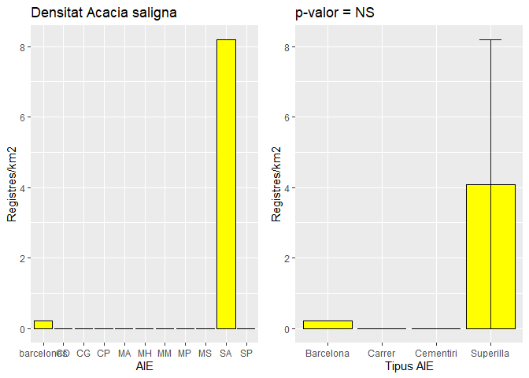
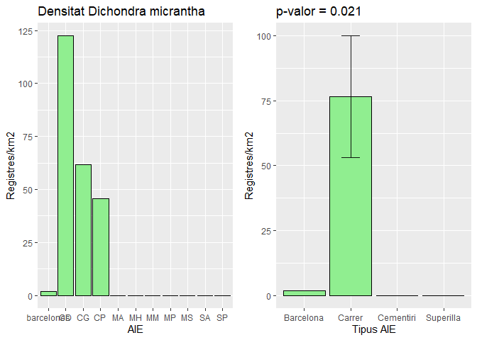
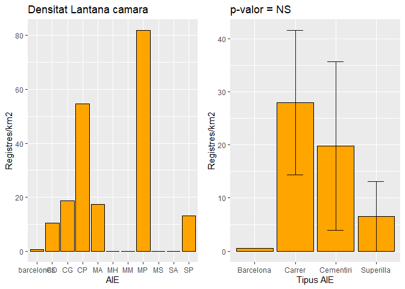
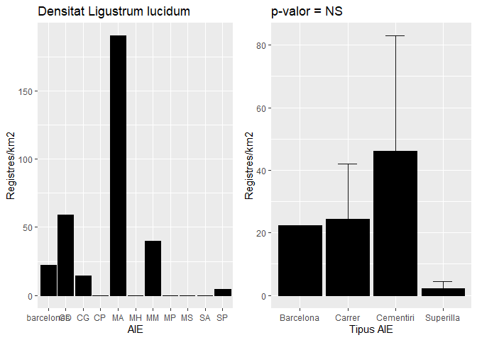
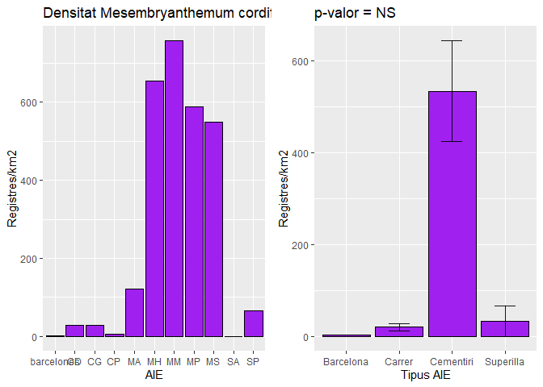
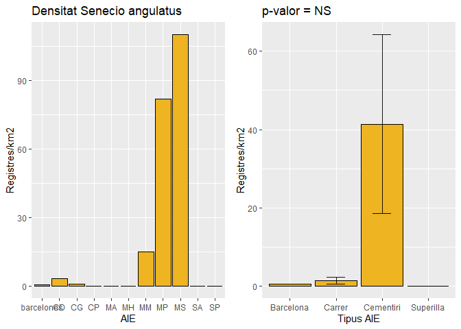

5AnalisiAreesInteresEspecial
================
Erola Fenollosa
20/12/2021

## Introducció i descarrega de paquets

L'objectiu d'aquest script és l'anàlisi d'arees d'interès especial sobre els quals s'ha fet un especial esforç de mostreig per part de l'equip de treball per a poder respondre a diverses qüestions relacionades amb la distribució d'aquestes espècies en la ciutat.

Carreguem els paquets necesaris:

``` r
library(sf)
library(dplyr)
library(tidyverse)
library(gridExtra)
library(pgirmess)
```

Carreguem les dades obtingudes en els anteriors scripts:

``` r
actdf <- read.csv(file = 'Datasets/xy_act_iNat_OpenData.csv')
actdf = subset(actdf, select = -c(X))
head(actdf)
```

    ##    latitud longitud     taxon.name
    ## 1 41.40136 2.211263 Acacia saligna
    ## 2 41.39943 2.208747 Acacia saligna
    ## 3 41.40143 2.211312 Acacia saligna
    ## 4 41.39942 2.208807 Acacia saligna
    ## 5 41.40591 2.216637 Acacia saligna
    ## 6 41.41883 2.147123 Acacia saligna

## Disseny experimental

Les àrees mostrejades han estat delimitades en el següent mapa: <https://www.google.com/maps/d/u/0/edit?mid=1zKP73GWKfj9CqJmftumOEowJaoyUvBG4&usp=sharing>

L'objectiu de la dessignació d'aquestes àrees ha estat múltiple. En primer lloc, considerant que l'abast del projecte no permetia cobrir tota l'àrea de la ciutat de Barcelona fent un registre intensiu de presències i absències de les 10 espècies selecciondes, els resultats obtinguts estaràn sempre esviaixats per l'esforç de mostreig no homogeni sobre la ciutat. Malgrat això, el present projecte prepara i posa en marxa un marc de recollida de dades i d'anàlisi de manera que gràcies a la contribució ciutadana sigui possible cada cop captar més la presència de les espècies per la ciutat. Per aquest motiu ens vam plantejar seleccionar àrees concretes de la ciutat on centrar els esforços i registrar no només presències sinò també absències de les 10 espècies de manera que sobre aquestes àrees el registre sigui total i poguem comparar-les amb la resta d'espais de la ciutat. En segon lloc, aquestes àrees d'interès especial (AIEs) van ser escollides captant l'heterogeneïtat de la ciutat i per a entendre el rol de certs espais d'ús divers pel ciutadà per a evaluar la presència i densitat de les espècies suceptibles a ser invasores en els diferents espais.

Els diferents tipus de zones escollides són:

-   **Carrers conectors dels eixos de Barcelona**: Avinguda Diagonal(CD), Gran via de les Corts Catalanes (CG) i Passeig de Sant Joan (CP)

-   **Superilles**: Superilla del Poblenou (SP) (<https://ajuntament.barcelona.cat/superilles/ca/content/poblenou>) i Superilla de Sant Antoni (SA) (<https://ajuntament.barcelona.cat/superilles/ca/content/sant-antoni>)

-   **Cementiris**: Cementiri de Poblenou (MP), Montjuic (MM), Sant Andreu (MA), Horta (MH) i Sants (MS)

## Descàrrega de polígons i importació a R

Començo amb l'anàlisi d'una sola àrea, el Cementiri de Montjuic. Del mapa generat amb l'àrea exacta de les zones, descarreguem en KML l'àrea del cementiri de Montjuic, el guardo a la carpeta Cartogragia/AIEs i l'importem a R:

``` r
MM <- st_read("Cartografia/AIEs/CementiriMontjuic.kml")
```

    ## Reading layer `CementiriMontjuic' from data source 
    ##   `C:\Users\Erola\Documents\Actuem_a_temps_BCN\Cartografia\AIEs\CementiriMontjuic.kml' 
    ##   using driver `KML'
    ## Simple feature collection with 1 feature and 2 fields
    ## Geometry type: POLYGON
    ## Dimension:     XY
    ## Bounding box:  xmin: 2.149558 ymin: 41.35444 xmax: 2.1586 ymax: 41.35926
    ## Geodetic CRS:  WGS 84

``` r
plot(MM[1], main="Cementiri de Montjuic (MM)")
```

 Calculem-ne l'àrea, dividim per a tenir-ho en km2

``` r
st_area(MM)/1000000
```

    ## 0.2007999 [m^2]

Ara importem el conjunt de les altres AIEs:

``` r
CD <- st_read("Cartografia/AIEs/Diagonal.kml")
CG <- st_read("Cartografia/AIEs/GranViaDeLesCortsCatalanes.kml")
CP <- st_read("Cartografia/AIEs/PasseigDeSantJoan.kml")
SP <- st_read("Cartografia/AIEs/SuperillaPoblenou.kml")
SA <- st_read("Cartografia/AIEs/SuperillaSantAntoni.kml")
MP <- st_read("Cartografia/AIEs/CementiriPoblenou.kml")
MM <- st_read("Cartografia/AIEs/CementiriMontjuic.kml")
MA <- st_read("Cartografia/AIEs/CementiriSantAndreu.kml")
MH <- st_read("Cartografia/AIEs/CementiriHorta.kml")
MS <- st_read("Cartografia/AIEs/CementiriSants.kml")
```

Vegem-les totes sobre el mapa de Barcelona per entendre l'àrea coberta:

``` r
barcelones <- st_read('Cartografia/shapefiles_catalunya_comarcas/shapefiles_catalunya_comarcas.shp')
```

    ## Reading layer `shapefiles_catalunya_comarcas' from data source 
    ##   `C:\Users\Erola\Documents\Actuem_a_temps_BCN\Cartografia\shapefiles_catalunya_comarcas\shapefiles_catalunya_comarcas.shp' 
    ##   using driver `ESRI Shapefile'
    ## Simple feature collection with 1 feature and 5 fields
    ## Geometry type: MULTIPOLYGON
    ## Dimension:     XY
    ## Bounding box:  xmin: 2.052651 ymin: 41.31702 xmax: 2.269917 ymax: 41.49271
    ## Geodetic CRS:  WGS 84

``` r
ggplot() +
 geom_sf(data = barcelones) +
  geom_point(aes(x = actdf$longitud, y = actdf$latitud), col = "firebrick3", alpha=0.1, size=0.3) +
  xlim(2.05, 2.30) +
  ylim(41.30, 41.50) + 
  ggtitle("Registres totals espècies susceptibles a \n ser invasores al Barcelonès i AIEs") +
  geom_sf(data = CD, fill="blue", alpha =0.3)+
  geom_sf(data = CG, fill="blue", alpha =0.3)+
  geom_sf(data = CP, fill="blue", alpha =0.3)+
  geom_sf(data = SP, fill="green", alpha =0.3)+
  geom_sf(data = SA, fill="green", alpha =0.3)+
  geom_sf(data = SA, fill="black", alpha =0.3)+
  geom_sf(data = MP, fill="black", alpha =0.3)+
  geom_sf(data = MM, fill="black", alpha =0.3)+
  geom_sf(data = MA, fill="black", alpha =0.3)+
  geom_sf(data = MH, fill="black", alpha =0.3)+
  geom_sf(data = MS, fill="black", alpha =0.3)+
  xlab("Longitud") + ylab("Latitud") + theme_classic() 
```


## Filtratge de registres per àrea

Ara filtrem els registres dins cada àrea, per exemple, per l'àrea del cementiri de Montjuic. Per a la resta d'àrees ho calcularem en base a funcions posteriorment.

``` r
actdf_sf <-  actdf %>% 
  st_as_sf(coords=c("longitud", "latitud"), crs=4326)
print(paste("Nº registres totals:", dim(actdf_sf)[1]))
```

    ## [1] "Nº registres totals: 4497"

``` r
actdf_sf_MM  <- actdf_sf %>% st_intersection(MM)
print(paste("Nº registres en l'àrea:", nrow(actdf_sf_MM)))
```

    ## [1] "Nº registres en l'àrea: 178"

``` r
print(paste("Percentatge registres en l'àrea:", round(nrow(actdf_sf_MM)*100/ dim(actdf_sf)[1],2), "%"))
```

    ## [1] "Percentatge registres en l'àrea: 3.96 %"

## Càlcul de densitat dins de les àrees d'interès especial

Ara procedim a calcular la densitat dins les AIE, en registres totals/km2. Ho fem amb l'exemple del cementiri de Montjuic. Per la resta d'AIEs ho introduirem dins de funcions més endavant.

``` r
nrow(actdf_sf_MM)/(st_area(MM)/1000000)
```

    ## 886.4548 [1/m^2]

I per a cada espècie:

``` r
# Recordem la funció creada al script 2:
num_registres <- function(area, inatdf) {
  inat_obs_pcsp_sf  <- inatdf %>% st_intersection(area)
  return(nrow(inat_obs_pcsp_sf))
} 

num_registres(MM, actdf_sf[actdf_sf$taxon.name=="Mesembryanthemum cordifolium",])
```

    ## [1] 152

Preparo una funció per a donats un dataset, un nom d'espècie i una àrea d'interès, retorni el nombre de registres i una altra que retorni la densitat de registres en funció de l'àrea de l'AIE, així podrem filtrar i calcular el nombre de registres i densitat de totes les AIE.

``` r
num_registres_especie_AIE <- function(dataset, especie, AIE) {
  inat_obs_pcsp_sf  <- dataset %>% st_intersection(AIE)
  dataset_sp <- inat_obs_pcsp_sf[inat_obs_pcsp_sf$taxon.name==especie,]
  return(nrow(dataset_sp))
} 

densitat_especie_AIE <- function(dataset, especie, AIE) {
  inat_obs_pcsp_sf  <- dataset %>% st_intersection(AIE)
  dataset_sp <- inat_obs_pcsp_sf[inat_obs_pcsp_sf$taxon.name==especie,]
  return(nrow(dataset_sp)/(st_area(AIE)/1000000))
} 
```

Ho provem amb l'espècie més abundant en el cementiri de Montjuic:

``` r
num_registres_especie_AIE(actdf_sf, "Mesembryanthemum cordifolium", MM)
```

    ## [1] 152

``` r
densitat_especie_AIE(actdf_sf, "Mesembryanthemum cordifolium", MM)
```

    ## 756.9726 [1/m^2]

Preparo també una funció per a fer diferents gràfics per a visualitzar el nombre de registres, la densitat i la proporció en un AIE:

``` r
graficsAIE <- function(dataset, AIE){
 datasetAIE  <- dataset %>% st_intersection(AIE)
  
    # 1. Nº registres
  freqpl <- ggplot(datasetAIE,aes(x = fct_infreq(taxon.name))) + 
    geom_bar(stat = 'count', fill = "coral")+ coord_flip() + xlab("Espècie")+ ylab("Nombre de registres") + labs(title = (paste("Nombre de registres de registres a" , deparse(substitute(AIE)))))
  
  # 2.  densitat de registres
  sp <- c()
  densitat <- c()
  for (i in 1:length(levels(as.factor(datasetAIE$taxon.name)))){
    sp[i] <- levels(as.factor(datasetAIE$taxon.name))[i]
    densitat[i] <- densitat_especie_AIE(datasetAIE, levels(as.factor(datasetAIE$taxon.name))[i], AIE)
  }
  
  dataespeciedensitat <- data.frame(especie = sp, densitat = densitat)
  print(dataespeciedensitat)
 densiplot<- ggplot(dataespeciedensitat, aes(x=reorder(especie, -densitat), y= densitat)) + geom_bar(stat="identity", color="coral", fill="white") + coord_flip() + ylab("Registres/km2") + xlab("Espècie") + labs(title = (paste("Densitat de registres a" , deparse(substitute(AIE)))))
 
  # 3. proporcio de cada especie
  propplot <- ggplot(dataespeciedensitat, aes(x="", y=densitat, fill=especie)) +
  geom_bar(stat="identity", width=1, color = "white") +
  coord_polar("y", start=0) + scale_fill_brewer(palette="Set1") + labs(title = (paste("Proporció de cada espècie a" , deparse(substitute(AIE))))) + xlab("") + ylab("")
  
  grid.arrange(freqpl, densiplot, nrow = 2)
  print(propplot)
}
```

## Comparació d'àrees d'interès especial

En primer lloc generem els gràfics per a totes les AIEs amb la funció que hem creat, incloent també el global de la ciutat:

**Global ciutat**

``` r
graficsAIE(actdf_sf, barcelones)
```

    ##                         especie   densitat
    ## 1                Acacia saligna  0.2257484
    ## 2           Cenchrus longisetus  0.5335872
    ## 3           Dichondra micrantha  1.8196693
    ## 4                Ipomoea indica  0.4036109
    ## 5        Kalanchoe × houghtonii  0.5883141
    ## 6                       Lantana  0.2189076
    ## 7                Lantana camara  0.5677915
    ## 8             Ligustrum lucidum 22.2806873
    ## 9  Mesembryanthemum cordifolium  2.2916887
    ## 10             Mirabilis jalapa  1.3681724
    ## 11            Senecio angulatus  0.4446560


**Carrers:**

``` r
graficsAIE(actdf_sf, CD)
```

    ##                         especie    densitat
    ## 1           Cenchrus longisetus  25.4364400
    ## 2           Dichondra micrantha 122.4128675
    ## 3                Ipomoea indica   0.7948887
    ## 4        Kalanchoe × houghtonii   3.1795550
    ## 5                       Lantana   3.9744437
    ## 6                Lantana camara  10.3335537
    ## 7             Ligustrum lucidum  58.8217675
    ## 8  Mesembryanthemum cordifolium  27.8211062
    ## 9              Mirabilis jalapa  37.3597712
    ## 10            Senecio angulatus   3.1795550


``` r
graficsAIE(actdf_sf, CG)
```

    ##                         especie   densitat
    ## 1           Cenchrus longisetus  0.8925607
    ## 2           Dichondra micrantha 61.5866870
    ## 3                Ipomoea indica  0.8925607
    ## 4        Kalanchoe × houghtonii  9.8181675
    ## 5                       Lantana  2.6776820
    ## 6                Lantana camara 18.7437743
    ## 7             Ligustrum lucidum 14.2809709
    ## 8  Mesembryanthemum cordifolium 28.5619418
    ## 9              Mirabilis jalapa  0.8925607
    ## 10            Senecio angulatus  0.8925607


``` r
graficsAIE(actdf_sf, CP)
```

    ##                        especie  densitat
    ## 1          Dichondra micrantha 45.539449
    ## 2                      Lantana  9.107890
    ## 3               Lantana camara 54.647339
    ## 4 Mesembryanthemum cordifolium  4.553945


**Superilles:**

``` r
graficsAIE(actdf_sf, SP)
```

    ##                        especie densitat
    ## 1       Kalanchoe × houghtonii 43.80980
    ## 2                      Lantana  8.76196
    ## 3               Lantana camara 13.14294
    ## 4            Ligustrum lucidum  4.38098
    ## 5 Mesembryanthemum cordifolium 65.71470
    ## 6             Mirabilis jalapa 52.57176


``` r
graficsAIE(actdf_sf, SA)
```

    ##          especie densitat
    ## 1 Acacia saligna 8.185836


**Cementiris:**

``` r
graficsAIE(actdf_sf, MP)
```

    ##                        especie   densitat
    ## 1       Kalanchoe × houghtonii  130.87914
    ## 2                      Lantana   16.35989
    ## 3               Lantana camara   81.79946
    ## 4 Mesembryanthemum cordifolium  588.95612
    ## 5             Mirabilis jalapa 1308.79137
    ## 6            Senecio angulatus   81.79946


``` r
graficsAIE(actdf_sf, MM)
```

    ##                        especie   densitat
    ## 1          Cenchrus longisetus   9.960166
    ## 2       Kalanchoe × houghtonii  64.741078
    ## 3            Ligustrum lucidum  39.840663
    ## 4 Mesembryanthemum cordifolium 756.972600
    ## 5            Senecio angulatus  14.940249


``` r
graficsAIE(actdf_sf, MA)
```

    ##                        especie  densitat
    ## 1       Kalanchoe × houghtonii  51.88414
    ## 2                      Lantana  51.88414
    ## 3               Lantana camara  17.29471
    ## 4            Ligustrum lucidum 190.24183
    ## 5 Mesembryanthemum cordifolium 121.06298
    ## 6             Mirabilis jalapa 172.94712


``` r
graficsAIE(actdf_sf, MH)
```

    ##                        especie densitat
    ## 1          Cenchrus longisetus 435.6557
    ## 2 Mesembryanthemum cordifolium 653.4836


``` r
graficsAIE(actdf_sf, MS)
```

    ##                        especie densitat
    ## 1 Mesembryanthemum cordifolium 549.8081
    ## 2             Mirabilis jalapa 109.9616
    ## 3            Senecio angulatus 109.9616


Per a testar diferències entre les AIEs, ens plantejem les següents preguntes:

-   A. Hi ha diferències entre el **nombre d'espècies** susceptibles a ser invasores **trobades** en el global de la ciutat, en carrers, superilles, i cementiris?
-   B. Hi ha diferències entre la **densitat** de registres del **global** d'espècies susceptibles a ser invasores entre el global de la ciutat, en carrers, superilles, i cementiris?
-   C. Hi ha diferències entre la **densitat** de registres per a **cadascuna de les espècies** susceptibles a ser invasores entre el global de la ciutat, en carrers, superilles, i cementiris?
-   D. Hi ha **similitud** entre la quantitat i proporció d'espècies trobades en les AIEs de la mateixa classe? (P.ex. són més similars els diferents cementiris entre ells que amb els carrers?)

A continuació generearem les dades per a poder respondre a cadascuna de les preguntes plantejades.

### A - Nombre d'espècies

Testarem la pregunta A:Hi ha diferències entre el **nombre d'espècies** susceptibles a ser invasores **trobades** en el global de la ciutat, en carrers, superilles, i cementiris?. Per a fer-ho, calculem el nombre d'espècies i la densitat:

``` r
num_species <- function(dataset, AIE){
 datasetAIE  <- dataset %>% st_intersection(AIE)
  return(length(levels(as.factor(datasetAIE$taxon.name))))
}

num_species_dens <- function(dataset, AIE){
 datasetAIE  <- dataset %>% st_intersection(AIE)
  return(length(levels(as.factor(datasetAIE$taxon.name)))/(st_area(AIE)/1000000))
}

llistatAIE <- c("barcelones", "CD", "CG", "CP", "SP", "SA", "MP" , "MM", "MA", "MH", "MS")

num_species_found <- c()
num_species_found_density <- c()
x <- 1
for (i in llistatAIE){
  num_species_found[x]<- num_species(actdf_sf, get(i))
   num_species_found_density[x]<- num_species_dens(actdf_sf, get(i))
  x<- x+1
}

num_species_found_df <- data.frame(AIE = llistatAIE, num_species_found=num_species_found, num_species_found_density = num_species_found_density)
num_species_found_df
```

    ##           AIE num_species_found num_species_found_density
    ## 1  barcelones                11                0.07524948
    ## 2          CD                10                7.94888750
    ## 3          CG                10                8.92560681
    ## 4          CP                 4               18.21577957
    ## 5          SP                 6               26.28588096
    ## 6          SA                 1                8.18583554
    ## 7          MP                 6               98.15935292
    ## 8          MM                 5               24.90041447
    ## 9          MA                 6              103.76827258
    ## 10         MH                 2              435.65570372
    ## 11         MS                 3              329.88487892

Generem gràfics per a veure els resultats:

``` r
ggplot(num_species_found_df, aes(x=AIE, y= num_species_found)) + geom_bar(stat="identity", color="black", fill="lightgreen") + coord_flip() + ylab("Nº espècies trobades") + xlab("Espècie") + labs(title = (paste("Nombre espècies trobades" , deparse(substitute(AIE)))))
```


``` r
ggplot(num_species_found_df, aes(x=AIE, y= num_species_found_density)) + geom_bar(stat="identity", color="black", fill="white") + coord_flip() + ylab("Nº espècies trobades/km2") + xlab("Espècie") + labs(title = (paste("Densitat espècies trobades" , deparse(substitute(AIE)))))
```


Agrupem per tipologia de AIE:

``` r
num_species_found_df$tipus <- c("Barcelona", "Carrer","Carrer","Carrer", "Superilla", "Superilla", "Cementiri", "Cementiri", "Cementiri", "Cementiri", "Cementiri")
num_species_found_df
```

    ##           AIE num_species_found num_species_found_density     tipus
    ## 1  barcelones                11                0.07524948 Barcelona
    ## 2          CD                10                7.94888750    Carrer
    ## 3          CG                10                8.92560681    Carrer
    ## 4          CP                 4               18.21577957    Carrer
    ## 5          SP                 6               26.28588096 Superilla
    ## 6          SA                 1                8.18583554 Superilla
    ## 7          MP                 6               98.15935292 Cementiri
    ## 8          MM                 5               24.90041447 Cementiri
    ## 9          MA                 6              103.76827258 Cementiri
    ## 10         MH                 2              435.65570372 Cementiri
    ## 11         MS                 3              329.88487892 Cementiri

``` r
se <- function(x) sqrt(var(x) / length(x))

df <- num_species_found_df %>% 
  group_by(tipus) %>% 
  summarise(mean = mean(num_species_found),
            se = se(num_species_found))
ggplot(df) +
    geom_bar( aes(x=tipus, y=mean), stat="identity", color="black", fill="lightgreen") +
    geom_errorbar( aes(x=tipus, ymin=mean-se, ymax=mean+se), width=0.4, colour="black", alpha=0.9, size=0.5) + ylab("Nº espècies trobades") + xlab("Tipus AIE") + labs(title = (paste("Nombre espècies trobades" , deparse(substitute(AIE)))))
```


``` r
df <- num_species_found_df %>% 
  group_by(tipus) %>% 
  summarise(mean = mean(num_species_found_density),
            se = se(num_species_found_density))
ggplot(df) +
    geom_bar( aes(x=tipus, y=mean), stat="identity", color="black", fill="lightgreen") +
    geom_errorbar( aes(x=tipus, ymin=mean-se, ymax=mean+se), width=0.4, colour="black", alpha=0.9, size=0.5) + ylab("Densitat de nombre d'espècies trobades/km2") + xlab("Tipus AIE") + labs(title = (paste("Densitat de nombre d'espècies trobades" , deparse(substitute(AIE)))))
```


Testem si hi ha diferències significatives entre tipus d'AIE. Revisem si complim amb els requisits per a aplicar una ANOVA d'un factor, malgrat el disseny és no balancejat:

``` r
num_species_found_df_test <-num_species_found_df[-c(num_species_found_df$AIE=="barcelones"),] 

# Normalitat
shapiro.test(num_species_found_df_test$num_species_found) # si complim
```

    ## 
    ##  Shapiro-Wilk normality test
    ## 
    ## data:  num_species_found_df_test$num_species_found
    ## W = 0.927, p-value = 0.419

``` r
shapiro.test(log(num_species_found_df_test$num_species_found_density)) # Transformant a logaritme si complim requisit de normalitat
```

    ## 
    ##  Shapiro-Wilk normality test
    ## 
    ## data:  log(num_species_found_df_test$num_species_found_density)
    ## W = 0.89038, p-value = 0.1713

``` r
# Homocedasticitat
bartlett.test(num_species_found ~ tipus, data = num_species_found_df_test) # si complim
```

    ## 
    ##  Bartlett test of homogeneity of variances
    ## 
    ## data:  num_species_found by tipus
    ## Bartlett's K-squared = 1.1432, df = 2, p-value = 0.5646

``` r
bartlett.test(log(num_species_found_density) ~ tipus, data = num_species_found_df_test) # Transformant a logaritme si complim requisit 
```

    ## 
    ##  Bartlett test of homogeneity of variances
    ## 
    ## data:  log(num_species_found_density) by tipus
    ## Bartlett's K-squared = 1.4031, df = 2, p-value = 0.4958

Com que complim requisits procedim amb l'aplicació del test ANOVA d'un factor:

-   Pel nombre d'espècies trobades

``` r
# Compute the analysis of variance
res.aov <- aov(num_species_found ~ tipus, data = num_species_found_df_test)
# Summary of the analysis
summary(res.aov)
```

    ##             Df Sum Sq Mean Sq F value Pr(>F)
    ## tipus        2   32.4    16.2   2.282  0.173
    ## Residuals    7   49.7     7.1

``` r
# Multiple comparisons
TukeyHSD(res.aov)
```

    ##   Tukey multiple comparisons of means
    ##     95% family-wise confidence level
    ## 
    ## Fit: aov(formula = num_species_found ~ tipus, data = num_species_found_df_test)
    ## 
    ## $tipus
    ##                     diff        lwr      upr     p adj
    ## Cementiri-Carrer    -3.6  -9.330895 2.130895 0.2226522
    ## Superilla-Carrer    -4.5 -11.663619 2.663619 0.2226522
    ## Superilla-Cementiri -0.9  -7.465565 5.665565 0.9151359

-   Pel nombre d'espècies trobades per àrea

``` r
# Compute the analysis of variance
res.aov <- aov(log(num_species_found_density) ~ tipus, data = num_species_found_df_test)
# Summary of the analysis
summary(res.aov)
```

    ##             Df Sum Sq Mean Sq F value Pr(>F)  
    ## tipus        2 13.992   6.996   7.805 0.0165 *
    ## Residuals    7  6.274   0.896                 
    ## ---
    ## Signif. codes:  0 '***' 0.001 '**' 0.01 '*' 0.05 '.' 0.1 ' ' 1

``` r
# Multiple comparisons
TukeyHSD(res.aov)
```

    ##   Tukey multiple comparisons of means
    ##     95% family-wise confidence level
    ## 
    ## Fit: aov(formula = log(num_species_found_density) ~ tipus, data = num_species_found_df_test)
    ## 
    ## $tipus
    ##                           diff        lwr      upr     p adj
    ## Cementiri-Carrer     2.4757651  0.4395277 4.512002 0.0214284
    ## Superilla-Carrer     0.2976371 -2.2476596 2.842934 0.9372885
    ## Superilla-Cementiri -2.1781280 -4.5109309 0.154675 0.0653093

Únicament trobem diferències significatives en el tipus d'AIE considerant el nombre d'espècies trobades per àrea i les diferències es troben entre els Cementiris i els Carrers, trobant als Cementiris significativament més espècies que als Carrers de Barcleona per unitat d'àrea.

### B - Densitat global

Testejem ara la segona pregunta B: Hi ha diferències entre la **densitat** de registres del **global** d'espècies susceptibles a ser invasores entre el global de la ciutat, en carrers, superilles, i cementiris? Generem les dades i la visualització:

``` r
densitat_global<- function(dataset, AIE){
 datasetAIE  <- dataset %>% st_intersection(AIE)
  return(nrow(datasetAIE)/(st_area(AIE)/1000000))
 }

llistatAIE <- c("barcelones", "CD", "CG", "CP", "SP", "SA", "MP" , "MM", "MA", "MH", "MS")
vectorres <- c()
x <- 1
for (i in llistatAIE){
  vectorres[x]<- densitat_global(actdf_sf, get(i))
  x<- x+1
}

densitat_df <- data.frame(AIE = llistatAIE, densitat=vectorres)
densitat_df$tipus <- c("Barcelona", "Carrer","Carrer","Carrer", "Superilla", "Superilla", "Cementiri", "Cementiri", "Cementiri", "Cementiri", "Cementiri")
densitat_df
```

    ##           AIE    densitat     tipus
    ## 1  barcelones   30.742834 Barcelona
    ## 2          CD  293.313949    Carrer
    ## 3          CG  139.239466    Carrer
    ## 4          CP  113.848622    Carrer
    ## 5          SP  188.382147 Superilla
    ## 6          SA    8.185836 Superilla
    ## 7          MP 2208.585441 Cementiri
    ## 8          MM  886.454755 Cementiri
    ## 9          MA  605.314923 Cementiri
    ## 10         MH 1089.139259 Cementiri
    ## 11         MS  769.731384 Cementiri

``` r
ggplot(densitat_df, aes(x=AIE, y= densitat)) + geom_bar(stat="identity", color="black", fill="gold") + coord_flip() + ylab("Densitat global espècies/km2") + xlab("Espècie") + labs(title = (paste("Densitat global espècies" , deparse(substitute(AIE)))))
```


``` r
df <- densitat_df %>% 
  group_by(tipus) %>% 
  summarise(mean = mean(densitat),
            se = se(densitat))
ggplot(df) +
    geom_bar( aes(x=tipus, y=mean), stat="identity", color="black", fill="gold") +
    geom_errorbar( aes(x=tipus, ymin=mean-se, ymax=mean+se), width=0.4, colour="black", alpha=0.9, size=0.5) + ylab("Densitat global espècies/km2") + xlab("Tipus AIE") + labs(title = (paste("Densitat global espècies" , deparse(substitute(AIE)))))
```


Testem si hi ha diferències significatives entre tipus d'AIE. Revisem si complim amb els requisits per a aplicar una ANOVA d'un factor, malgrat el disseny és no balancejat:

``` r
densitat_df_test <-densitat_df[-c(densitat_df$AIE=="barcelones"),] 

# Normalitat
shapiro.test(log(densitat_df_test$densitat)) # si complim
```

    ## 
    ##  Shapiro-Wilk normality test
    ## 
    ## data:  log(densitat_df_test$densitat)
    ## W = 0.90471, p-value = 0.2466

``` r
# Homocedasticitat
bartlett.test(log(densitat) ~ tipus, data = densitat_df_test) # si complim
```

    ## 
    ##  Bartlett test of homogeneity of variances
    ## 
    ## data:  log(densitat) by tipus
    ## Bartlett's K-squared = 4.9011, df = 2, p-value = 0.08625

Com que complim requisits procedim amb l'aplicació del test ANOVA d'un factor:

``` r
# Compute the analysis of variance
res.aov <- aov(log(densitat) ~ tipus, data = densitat_df_test)
# Summary of the analysis
summary(res.aov)
```

    ##             Df Sum Sq Mean Sq F value Pr(>F)  
    ## tipus        2 16.529   8.264   9.061 0.0114 *
    ## Residuals    7  6.385   0.912                 
    ## ---
    ## Signif. codes:  0 '***' 0.001 '**' 0.01 '*' 0.05 '.' 0.1 ' ' 1

``` r
# Multiple comparisons
TukeyHSD(res.aov)
```

    ##   Tukey multiple comparisons of means
    ##     95% family-wise confidence level
    ## 
    ## Fit: aov(formula = log(densitat) ~ tipus, data = densitat_df_test)
    ## 
    ## $tipus
    ##                          diff       lwr        upr     p adj
    ## Cementiri-Carrer     1.789018 -0.265045  3.8430811 0.0842121
    ## Superilla-Carrer    -1.446997 -4.014576  1.1205816 0.2847542
    ## Superilla-Cementiri -3.236015 -5.589240 -0.8827904 0.0118155

Sí hi ha diferències entre tipus d'AIE, específicament entre les superilles i els cementiris, on aquests darrers presenten una densitat d'espècies susceptibles a ser invasores molt superior, tal i com veiem als gràfics.

### C - Densitat per espècie

Passem a la tercera pregunta, ens plantejave,: C. Hi ha diferències entre la **densitat** de registres per a **cadascuna de les espècies** susceptibles a ser invasores entre el global de la ciutat, en carrers, superilles, i cementiris? Per tant repetim l'anàlisi anterior filtrant per a cadascuna de les espècies susceptibles a ser invasores. Fem una funció per a no repetir tant de codi. Previament testo a banda el compliment de les assumpcions de la ANOVA per a cada espècie. No es compleixen les condicions en cap de manera que és necesari aplicar un test no paramètric. Opto pel test de Kruskal-Wallis, l'incorporo a la funció.

``` r
analisi_AIE_especie <- function(especie, colorespecie){
df_especie <-actdf_sf[actdf_sf$taxon.name==especie,]
vectorres <- c()
x <- 1
for (i in llistatAIE){
  vectorres[x]<- densitat_global(df_especie, get(i)) # Aquí canviem el dataset d'entrada
  x<- x+1
}

densitat_df <- data.frame(AIE = llistatAIE, densitat=vectorres)
densitat_df$tipus <- c("Barcelona", "Carrer","Carrer","Carrer", "Superilla", "Superilla", "Cementiri", "Cementiri", "Cementiri", "Cementiri", "Cementiri")
#print(densitat_df)

g1<-ggplot(densitat_df, aes(x=AIE, y= densitat)) + geom_bar(stat="identity", color="black", fill=colorespecie) + ylab("Registres/km2") + xlab("Espècie") + labs(title = (paste("Densitat" , paste(especie))))

df <- densitat_df %>% 
  group_by(tipus) %>% 
  summarise(mean = mean(densitat),
            se = se(densitat))

# test no parametric:
nparam <- kruskal.test(densitat ~ tipus, data = densitat_df)

if (nparam$p.value < 0.05) {
  print(kruskalmc(densitat_df$densitat, densitat_df$tipus))
  pvalor <- round(nparam$p.value,3)
} else{
  pvalor = "NS"
}

# pvalor <- nparam$p.value # Si es volgués veure el p-valor encara que sigui no significatiu.

g2<-ggplot(df) +
    geom_bar( aes(x=tipus, y=mean), stat="identity", color="black", fill=colorespecie) +
    geom_errorbar( aes(x=tipus, ymin=mean-se, ymax=mean+se), width=0.4, colour="black", alpha=0.9, size=0.5) + ylab("Registres/km2") + xlab("Tipus AIE") + labs(title = (paste("p-valor =", pvalor)))

grid.arrange(g1, g2, nrow = 1)
}
```

L'apliquem a les espècies:

``` r
analisi_AIE_especie("Acacia saligna", "yellow")
```



``` r
analisi_AIE_especie("Cenchrus longisetus", "gray")
```


``` r
analisi_AIE_especie("Dichondra micrantha", "lightgreen")
```

    ## Multiple comparison test after Kruskal-Wallis 
    ## p.value: 0.05 
    ## Comparisons
    ##                     obs.dif critical.dif difference
    ## Barcelona-Carrer          2    10.103756      FALSE
    ## Barcelona-Cementiri       4     9.585265      FALSE
    ## Barcelona-Superilla       4    10.716652      FALSE
    ## Carrer-Cementiri          6     6.390176      FALSE
    ## Carrer-Superilla          6     7.987721      FALSE
    ## Cementiri-Superilla       0     7.320867      FALSE



``` r
analisi_AIE_especie("Ipomoea indica", "pink")
```


``` r
analisi_AIE_especie("Kalanchoe × houghtonii", "red")
```


``` r
analisi_AIE_especie("Lantana camara", "orange")
```



``` r
analisi_AIE_especie("Ligustrum lucidum", "black")
```



``` r
analisi_AIE_especie("Mesembryanthemum cordifolium", "purple")
```



``` r
analisi_AIE_especie("Mirabilis jalapa", "darkred")
```


``` r
analisi_AIE_especie("Senecio angulatus", "goldenrod2")
```



### D - Similitud entre AIEs

D. Hi ha **similitud** entre la quantitat i proporció d'espècies trobades en les AIEs de la mateixa classe? (P.ex. són més similars els diferents cementiris entre ells que amb els carrers?)

## Comparació dins i fora àrees d'interès especial

## Impacte esforç de mostreig en AIE en les dades globals

## Mapes de densitat global i per espècie d'àrees d'interès especial
